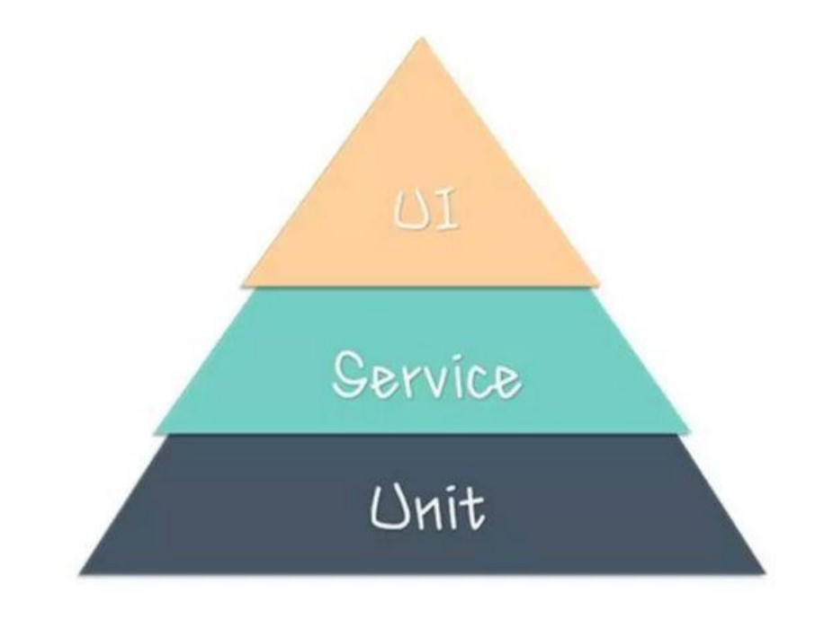

# 第1节：课程简介&接口测试概述

## 课程背景

在测试金字塔模型中分为三层：最底层是单元测试，中间层接口测试，最顶层为 UI 测试。接口测试位于第二层。

接口一般比较稳定，因此接口测试的效益最大,同时接口测试可以跨应用：Web/App 跨平台：Win，Mac,Liunx

等。本套课程中将会针对接口的基本理论，HTTP 协议、接口测试工具、Python 接口性能自动化测试来进行综合

讲解，让大家全面掌握接口自动化测试。

## 内容概要

* 接口基础知识
* HTTP协议基础原理
* 接口测试工具使用
* 接口性能自动化测试
* Restful接口开发测试
* Python + Requests接口测试
* 接口Mock Server

## 课程目标

* 掌握接口测试理论方法
* 掌握接口测试工具使用
* 掌握 HTTP 协议
* 独立编写 Python 接口测试脚本
* 独立完成接口性能自动化测试
* 熟悉 Restful 接口开发与调试

## 学习建议

* 有问题上自学网问答平台:<http://wen.51zxw.net>，不建灌水斗图吐槽群
* 遇到问题多谷歌，打不开？谷歌镜像站:<https://guge3.bban.top/>
* 下载自学网 APP 移动学习，各大应用市场均可下载。
* 留言打卡学习，见证学习成长轨迹。
* 夯实语言基础：Pyhotn
* 保持专注，排除干扰, 推荐 GTD 番茄学习法

##  什么是接口？

### API

API（Application Programming Interface,应用程序编程接口）是一些预先定义的函数，目的是提供应用程序与

开发人员基于某软件或硬件得以访问一组例程的能力，而又无需访问源码，或理解内部工作机制的细节。

举例说明：

* 笔记本电脑上提供了各种物理硬件接口，比如 USB 接口，耳机接口、麦克风接口、电源接口等.... 这些不

同的接口有不同的功能：比如通过 USB 接口插入 U 盘就可以拷贝电脑数据，插入耳机接口可以听音乐，我

们无需关心这些接口的工作原理，只需通过这些接口满足我们的使用需求即可。

* 在中国天气网网上查询某个城市天气，主要输入城市名称，即可获取到对应的天气。查询背后的本质也是

调用了网站后台接口来获取数据，这里的接口是 Web 服务软件接口。用户不需要关注数据在网站后台是怎

么查询的，只需要返回一个结果即可。

### 开放平台

基于互联网的应用正变得越来越普及，在这个过程中，有更多的站点将自身的资源开放给开发者来调用。对外提供

的 API 调用使得站点之间的内容关联性更强，同时这些开放的平台也为用户、开发者和中小网站带来了更大的价值。

[气象大数据交易平台](http://data.cma.cn/Market/index.html)

[微信开放平台](https://open.weixin.qq.com/)

## 接口测试

### 什么是接口测试？

接口测试是对系统或组件之间的接口进行测试，主要是校验数据的交换，传递和控制管理过程，以及相互逻辑依赖

关系。其中接口协议分为 HTTP,WebService,Dubbo,Thrift,Socket 等类型，本套课程主要是针对 HTTP 类型接口来进行

讲解。测试类型又主要分为功能测试，性能测试，稳定性测试，安全性测试等。

### 为什么要做接口测试？

接口测试实施在多系统的平台架构下，有着极为高效的成本收益比（当然，单元测试收益更高，但实施单元测试的

成本投入更大，技术要求更高）。

接口测试天生为高复杂性的平台带来高效的缺陷检测和质量监督能力，平台复杂，系统越庞大，接口测试的效果越

明显。

接口测试优势主要体现在如下三个方面：

1、节省了测试成本

根据数据模型推算，底层的一个程序 BUG 可能引发 UI 层的 8 个左右 BUG，而且底层的 BUG 更容易引起全网的死

机；接口测试能够提供系统复杂度上升情况下的低成本高效率的解决方案。

2、接口测试门槛相对较低

接口测试不同于单元测试，接口测试是站在用户的角度对系统接口进行全面高效持续的检测。

3、效益更高

将接口测试实现为自动化和持续集成，当系统复杂度和体积越大，接口测试的成本就越低，相对应的，效益产出就

越高。

### 怎么样去做接口测试？

基本的接口功能自动化测试流程如下：

需求分析 -> 用例设计 -> 脚本开发 -> 测试执行 -> 结果分析

#### 需求分析

需求分析是参考需求、设计等文档，在了解需求的基础上还需清楚内部的实现逻辑，并且可以在这一阶段提出需求、

设计存在的不合理或遗漏之处。

#### 用例设计

用例设计是在理解接口测试需求的基础上，使用 Excel 或 XMind 等思维导图软件编写测试用例设计，主要内容包括

参数校验，功能校验、业务场景校验、安全性及性能校验等，常用的用例设计方法有等价类划分法，边界值分析法，

场景分析法，因果图，正交表等。

#### 脚本开发

使用自己熟悉的语言或者工具来开发即可。

#### 测试执行

可以直接运行接口测试脚本或者使用 CI 来执行测试

#### 结果分析

根据测试报告来分析接口测试结果。

## 参考资料

* <https://baike.baidu.com/item/接口/2886384?fr=aladdin>
* <https://blog.csdn.net/lovesoo/article/details/78558303?locationNum=9&fps=1>
* <https://www.cnblogs.com/imyalost/p/7430126.html>
* <https://testerhome.com/topics/11051>

