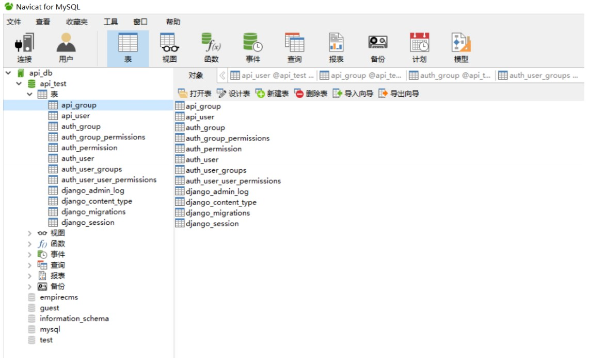
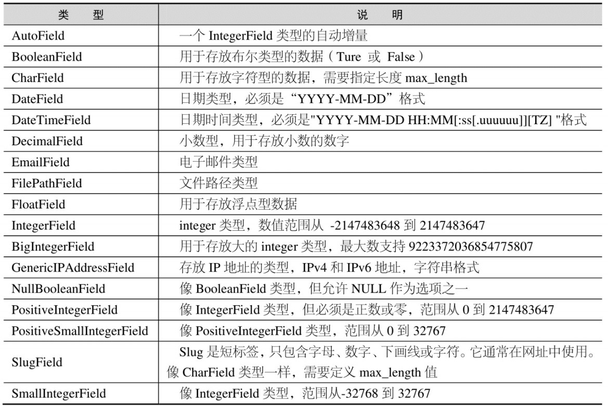
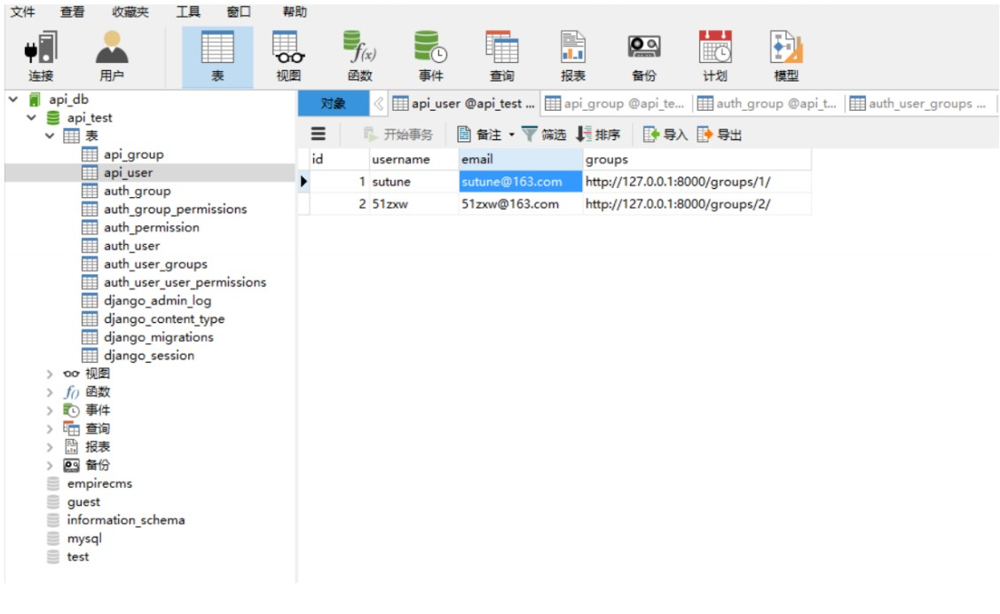
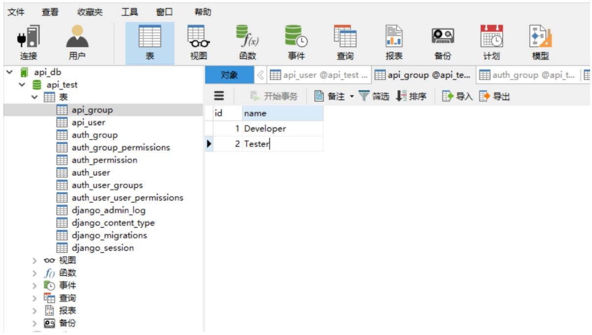
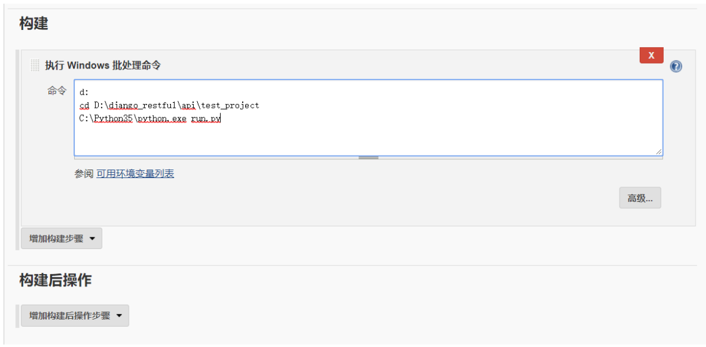

# 第4节：Django数据管理

## 问题思考
在接口测试过程中，由于有些接口类型并不是安全的，比如 DELETE 类型，上一次请求之后下一次再请求结果就不一
样了。甚至有时接口之间的数据还会相互干扰， 导致接口断言失败时不能断定到底是接口程序引起的错误，还是测试数据变化引起的错误，那么该如何有效解决这个问题呢？

## 解决思路
通过测试数据库，每轮测试之前将数据初始化，这样避免数据干扰。


## Django 数据库管理
在之前我们的接口项目 django_resutful 使用的数据库是 Python 自带的 SQLite3。
Django 还支持以下几种数据库：
• [PostgreSQL](http://postgresql.org/)
• [MySQL](http://www.mysql.com/)
• [Oracle](http://www.oracle.com/)
接下来我们将会以 Mysql 来进行演示。


### mysql 简介
MySQL 是一个关系型数据库管理系统，由瑞典 MySQL AB 公司开发，目前属于 Oracle 旗下产品。MySQL 是
最流行的关系型数据库管理系统之一，在 WEB 应用方面，MySQL 是最好的 RDBMS (Relational Database
Management System，关系数据库管理系统) 应用软件。

### mysql 下载安装
下载地址：https://dev.mysql.com/downloads/installer/
安装教程：[自学网-Mysql 教程](http://www.51zxw.net/list.aspx?cid=651)

###  Navicat
Navicat 是一套数据库管理工具，专为简化数据库的管理及降低系统管理成本而设。Navicat 是以直觉化的图形用户界面而建的，让你可以以安全并且简单的方式创建、组织、访问并共用信息。


## Django 迁移 MySql
### 修改 Setting 配置

首先打开 setting.py 将 DATABASES 修改如下：


```
DATABASES = {
    'default': {
        # 'ENGINE': 'django.db.backends.sqlite3',
        # 'NAME': os.path.join(BASE_DIR, 'db.sqlite3'),
        'ENGINE':'django.db.backends.mysql',
        'HOST':'127.0.0.1',
        'PORT':'3306',
        'NAME':'django_restful',
        'USER':'root',
        'PASSWORD':'',
        'OPTIONS':{
            'isolation_level':None,
            'init_command': "SET sql_mode='STRICT_TRANS_TABLES'", },
    }
}
```

也就是将原来 sqllite 换成 Mysql


### 安装 MySQLdb 驱动
再打开 django_restful 中的__init__.py，添加如下代码：
```
import pymysql
pymysql.install_as_MySQLdb()
```
上面代码表示安装 MySQLdb 驱动。

### 连接数据库

使用 Navicat 连接数据库如下所示：



然后创建数据库 django_restful

### 创建 Models
Django 提供了完善的模型（model）层来创建和存取数据，它包含你所储存数据的必要字段和行为。通常，每个模型对应数据库中唯一的一张表。

打开 api 中的 models.py 创建如下代码：

```
from django.db import models

# Create your models here.
class User(models.Model):
    username=models.CharField(max_length=100)
    email=models.CharField(max_length=100)
    groups=models.CharField(max_length=100)
    
    def __str__(self):
        return self.username
    
class Group(models.Model):
    name=models.CharField(max_length=100)
    
    def __str__(self):
        return self.name

```

上面代码表示创建数据库的表，一个是 User，另外一个是 Group
其中 ```def __str__()```的作用是美化字段的显示，方便查看。如果没有__st__方法，显示的结果是类似```<__main__.Testobject at 0x0000022D6D1387B8>```

Django 模型字段常用类型




### 导入 Models
创建好 Model 后需要分别在 serializers.py 和 views.py 来导入，同时去掉 danjo 默认的数据库。
**serializers.py**
```
# from django.contrib.auth.models import User,Group
from rest_framework import serializers
from api.models import User,Group
```
**views.py**

```
# from django.contrib.auth.models import User,Group
from rest_framework import viewsets

from api.serializers import UserSerializer,GroupSerializer
from api.models import User,Group
```


### 数据库迁移
```
python manage.py makemigrations api
python manage.py migrate
```
迁移完成之后需要重新设置一个超级管理员账户，然后登录。
```
python manage.py createsuperuser
```
### 数据库初始化
### 封装初始化操作

数据初始化操作主要包括：数据库连接，数据清除、数据插入、关闭数据库。 在 api 项目下面新建一个目录
test_project 然后创建文件：mysql_action.py

扩展资料：[SQL 命令教程](https://www.1keydata.com/cn/sql/sql-select.php)

```
from pymysql import connect
import yaml

class DB():
        def __init__(self):
        '''连接数据库'''
        print('connect db')
        self.conn=connect(host='127.0.0.1',user='root',
        password='',db='django_restful')

    def clear(self,table_name):
    '''清除表中数据'''
    print('clear db...')
    clear_sql = 'truncate ' + table_name + ';'
    with self.conn.cursor() as cursor:
        #清除外键约束
        cursor.execute("set foreign_key_checks=0;")
        cursor.execute(clear_sql)
    self.conn.commit()

def insert(self, table_name, table_data):
    '''插入数据'''
    print('insert db...')
    
    #遍历数据
    for key in table_data:
    table_data[key] = "'" + str(table_data[key]) + "'"
    
    key = ','.join(table_data.keys())
    value = ','.join(table_data.values())
    
    print(key)
    print(value)
    
    insert_sql = "insert into " + table_name + "(" + key + ")" + "values" + "(" + value + ")"
    print(inser_sql)
    
    with self.conn.cursor() as cursor:
        cursor.execute(insert_sql)
    self.conn.commit()


def close(self):
    '''关闭数据库连接'''
    print('close db')
    self.conn.close()

def init_data(self, datas):
    '''初始化数据'''
    print('init db...')
    for table, data in datas.items():
        self.clear(table)
        for d in data:
            self.insert(table, d)
    self.close()


if __name__ == '__main__':
    db=DB()
    #调试各个方法
    db.clear('api_user')
    db.clear('api_group')
    user_data={'id':1,'username':'51zxw','email':'51zxw@163.com'}
    db.insert('api_user',user_data)
    group_data={'id':1,'name':'Developer'}
    db.insert('api_group',group_data)
    db.close()
    
    #初始化数据
    f=open('datas.yaml','r')
    datas=yaml.load(f)
    db.init_data(datas)
```

### 封装初始化数据
我们将初始化数据使用 Yaml 来封装，可以将数据与代码分离，方便测试数据的维护。在 test_project 目录中创建datas.yaml 数据内容如下：

```

api_user:
    - id: 1
    username: sutune
    email: sutune@163.com
    groups: http://127.0.0.1:8000/groups/1/
    
    - id: 2
    username: 51zxw
    email: 51zxw@163.com
    groups: http://127.0.0.1:8000/groups/2/

api_group:
    - id: 1
    name: Developer
    - id: 2
    name: Tester

```

扩展资料： [Appium yaml 教程 5-1~5-4](http://www.51zxw.net/list.aspx?page=3&cid=670)

执行初始化后数据如下：






### 测试用例封装

在 test_project 下面创建一个测试模块 test_diango_restful.py
**test_django_restful.py**

```
import requests
import unittest
from mysql_action import DB
import yaml

class UserTest(unittest.TestCase):
    def setUp(self):
        self.base_url='http://127.0.0.1:8000/users'
        self.auth=('51zxw','zxw20182018')
    
    def test_001_get_user(self):
        r=requests.get(self.base_url+'/1/',auth=self.auth)
        result=r.json()
        
        self.assertEqual(result['username'],'sutune')
        self.assertEqual(result['email'],'sutune@163.com')
    
    # @unittest.skip('skip add user')
    def test_002_add_user(self):
        form_data={'id':3,'username':'zxw666','email':'zxw666@qq.com','groups':'http://127.0.0.1:8000/groups/2/'}
        r=requests.post(self.base_url+'/',data=form_data,auth=self.auth)
        result=r.json()
        
        self.assertEqual(result['username'],'zxw666')
    
    # @unittest.skip('skip test_delete_user')
    def test_003_delete_user(self):
        r=requests.delete(self.base_url+'/2/',auth=self.auth)
        
        self.assertEqual(r.status_code,204)
        
    def test_004_update_user(self):
        form_data={'email':'zxw2018@163.com'}
        r=requests.patch(self.base_url+'/1/',auth=self.auth,data=form_data)
        result=r.json()
        
        self.assertEqual(result['email'],'zxw2018@163.com')
    
    def test_005_no_auth(self):
        r=requests.get(self.base_url)
        result=r.json()
        
        self.assertEqual(result['detail'],'Authentication credentials were not provided.')


class GroupTest(unittest.TestCase):
    def setUp(self):
        self.base_url='http://127.0.0.1:8000/groups'
        self.auth=('51zxw','zxw20182018')
    
    def test_001_group_developer(self):
        r=requests.get(self.base_url+'/1/',auth=self.auth)
        result=r.json()
        
        self.assertEqual(result['name'],'Developer')
    
    def test_002_add_group(self):
        form_data={'name':'Pm'}
        r=requests.post(self.base_url+'/',auth=self.auth,data=form_data)
        result=r.json()
        
        self.assertEqual(result['name'],'Pm')
    
    def test_003_update_group(self):
        form_data={'name':'Boss'}
        r=requests.patch(self.base_url+'/2/',auth=self.auth,data=form_data)
        result=r.json()
        
        self.assertEqual(result['name'],'Boss')
    
    def test_004_detele_group(self):
        r=requests.delete(self.base_url+'/1/',auth=self.auth)
        
        self.assertEqual(r.status_code,204)


if __name__ == '__main__':

    db=DB()
    f = open('datas.yaml', 'r')
    datas = yaml.load(f)
    db.init_data(datas)
    unittest.main()

```

这样每次迭代回归测试就不用担心数据环境相互干扰的问题了。

### 执行用例&测试报告

在 test_project 目录下面创建 reports 目录，然后新建 run.py 模块。

```

import unittest
from BSTestRunner import BSTestRunner
from mysql_action import DB
import time
import yaml

#数据初始化操作
db=DB()
f = open('datas.yaml', 'r')
datas = yaml.load(f)
db.init_data(datas)

#指定测试用例和测试报告的路径
test_dir = '.'
report_dir = './reports'

#加载测试用例
discover = unittest.defaultTestLoader.discover(test_dir, pattern='test_django_restful.py')

#定义报告的文件格式
now = time.strftime("%Y-%m-%d %H_%M_%S")
report_name = report_dir + '/' + now + ' test_report.html'

#运行用例并生成测试报告
with open(report_name, 'wb') as f:
    runner = BSTestRunner(stream=f, title=" API Test Report", description="Django Restful Api Test Report")
    runner.run(discover)
```
最后生成的测试报告如下：


### 日志配置
在自动化测试项目中，日志是非常重要的一个部分，特别是当运行出现错误时，需要查看日志来分析定位解决问题。在 test_project 目录下面创建日志配置文件 log.conf 下面日志配置文件，定义的日志的输出格式，输出路径等信息。然后创建文件夹 logs 存放日志信息。

```
[loggers]
keys=root,infoLogger

[logger_root]
level=DEBUG
handlers=consoleHandler,fileHandler

[logger_infoLogger]
handlers=consoleHandler,fileHandler
qualname=infoLogger
propagate=0

[handlers]
keys=consoleHandler,fileHandler

[handler_consoleHandler]
class=StreamHandler
level=INFO
formatter=form02
args=(sys.stdout,)

[handler_fileHandler]
class=FileHandler
level=INFO
formatter=form01
args=('./logs/runlog.log', 'a')

[formatters]
keys=form01,form02

[formatter_form01]
format=%(asctime)s %(filename)s[line:%(lineno)d] %(levelname)s %(message)s

[formatter_form02]
format=%(asctime)s %(filename)s[line:%(lineno)d] %(levelname)s %(message)s


```

扩展资料: [Appium 教程 5-6~5-10](http://www.51zxw.net/list.aspx?page=3&cid=670)

在 run.py 引入配置文件

```
import unittest
from BSTestRunner import BSTestRunner
import time,yaml
from mysql_action import DB

import logging.config

#引入日志配置文件
CON_LOG='log.conf'
logging.config.fileConfig(CON_LOG)
logging=logging.getLogger()

#初始化数据
db=DB()
f=open('datas.yaml','r')
datas=yaml.load(f)
db.init_data(datas)

test_dir='.'
report_dir='./reports'


discover=unittest.defaultTestLoader.discover(test_dir,pattern='test_django_restful.py')

now=time.strftime('%Y-%m-%d %H_%M_%S')
report_name=report_dir+'/'+now+' test_report.html'

with open (report_name,'wb') as f:
    runner=BSTestRunner(stream=f,title='API Test Report',description='Django Restful API Test Report')
    logging.info('============API Test================')
    runner.run(discover)


```

在 mysql_action.py 添加日志

```
from pymysql import connect
import yaml
import logging

class DB():
    def __init__(self):
        logging.info('=============init data=================')
        logging.info('connect db...')
        self.conn=connect(host='127.0.0.1',user='root',password='',db='django_restful')

    def clear(self,table_name):
        logging.info('clear db...')
        clear_sql='truncate '+table_name+';'
        with self.conn.cursor() as cursor:
            cursor.execute('set foreign_key_checks=0;')
            cursor.execute(clear_sql)
        self.conn.commit()
    
    def insert(self,table_name,table_data):
        for key in table_data:
        table_data[key]="'"+str(table_data[key])+"'"
        
        key=','.join(table_data.keys())
        value=','.join(table_data.values())
        
        logging.info(key)
        logging.info(value)
        
        insert_sql='insert into '+table_name+'('+key+')'+'values'+'('+value+')'
        logging.info(insert_sql)
        
        with self.conn.cursor() as cursor:
            cursor.execute(insert_sql)
        self.conn.commit()
    
    def close(self):
        logging.info('close db')
        self.conn.close()
        logging.info('==============init data finished!=============')
    
    def init_data(self,datas):
        for table,data in datas.items():
            self.clear(table)
            for d in data:
                self.insert(table,d)
        self.close()

if __name__ == '__main__':
    db=DB()
    # db.clear('api_user')
    # db.clear('api_group')
    # user_data={'id':1,'username':'zxw2018','email':'zxw2018@163.com'}
    # db.insert('api_user',user_data)
    # db.close()
    
    f=open('datas.yaml','r')
    datas=yaml.load(f)
    db.init_data(datas)

```

最后在 test_django_restful.py 添加日志。

```

import requests
import unittest
from mysql_action import DB
import yaml
import logging

class UserTest(unittest.TestCase):
    def setUp(self):
        self.base_url='http://127.0.0.1:8000/users'
        self.auth=('51zxw','zxw20182018')
    
    def test_001_get_user(self):
        logging.info('test_001_get_user')
        r=requests.get(self.base_url+'/1/',auth=self.auth)
        result=r.json()
        
        self.assertEqual(result['username'],'sutune')
        self.assertEqual(result['email'],'sutune@163.com')
    
    def test_002_add_user(self):
        logging.info('test_002_add_user')

        form_data={'username':'zxw666','email':'zxw666@163.com','groups':'http://127.0.0.1:8000/groups/2/'}
        r=requests.post(self.base_url+'/',data=form_data,auth=self.auth)
        result=r.json()
        
        self.assertEqual(result['username'],'zxw666')
        self.assertEqual(result['email'],'zxw666@163.com')
        
    def test_003_update_user(self):
        logging.info('test_003_update_user')
        form_data={'email':'zxw2018@163.com'}
        r=requests.patch(self.base_url+'/1/',data=form_data,auth=self.auth)
        result=r.json()
        
        self.assertEqual(result['email'],'zxw2018@163.com')
    
    def test_004_delete_user(self):
        logging.info('test_004_delete_user')
        r=requests.delete(self.base_url+'/2/',auth=self.auth)
        
        self.assertEqual(r.status_code,204)
    
    def test_005_no_auth(self):
        logging.info('test_005_no_auth')
        r=requests.get(self.base_url)
        result=r.json()
        
        self.assertEqual(result['detail'],'Authentication credentials were not provided.')
    
    
class GroupTest(unittest.TestCase):
    def setUp(self):
        self.base_url='http://127.0.0.1:8000/groups'
        self.auth=('51zxw','zxw20182018')
    
    def test_001_group_developer(self):
        logging.info('test_001_group_developer')
        r=requests.get(self.base_url+'/1/',auth=self.auth)
        result=r.json()
        
        self.assertEqual(result['name'],'Developer')

    def test_002_add_group(self):
        logging.info('test_002_add_group')
        form_data={'name':'Pm'}
        r=requests.post(self.base_url+'/',data=form_data,auth=self.auth)
        result=r.json()
        
        self.assertEqual(result['name'],'Pm')
    
    def test_003_update_group(self):
        logging.info('test_003_update_group')
        form_data={'name':'Boss'}
        r=requests.patch(self.base_url+'/2/',data=form_data,auth=self.auth)
        result=r.json()
        
        self.assertEqual(result['name'],'Boss')
    
    def test_004_delete_group(self):
        logging.info('test_004_delete_group')
        r=requests.delete(self.base_url+'/1/',auth=self.auth)
        self.assertEqual(r.status_code,204)

if __name__ == '__main__':
    db=DB()
    f=open('datas.yaml','r')
    datas=yaml.load(f)
    db.init_data(datas)
    unittest.main()

```

运行完成之后可以在 logs 目录里面看到如下 log：

```
2018-08-20 11:25:57,456 mysql_action.py[line:7] INFO =============init data=================
2018-08-20 11:25:57,456 mysql_action.py[line:8] INFO connect db...
2018-08-20 11:25:57,465 mysql_action.py[line:12] INFO clear db...
2018-08-20 11:25:57,469 mysql_action.py[line:26] INFO email,username,id,groups
2018-08-20 11:25:57,469 mysql_action.py[line:27] INFO
'sutune@163.com','sutune','1','http://127.0.0.1:8000/groups/1/'
2018-08-20 11:25:57,470 mysql_action.py[line:30] INFO insert into
api_user(email,username,id,groups)values('sutune@163.com','sutune','1','http://127.0.0.1:8000/groups/1/')
2018-08-20 11:25:57,471 mysql_action.py[line:26] INFO email,username,id,groups

2018-08-20 11:25:57,471 mysql_action.py[line:27] INFO
'51zxw@163.com','51zxw','2','http://127.0.0.1:8000/groups/2/'
2018-08-20 11:25:57,473 mysql_action.py[line:30] INFO insert into
api_user(email,username,id,groups)values('51zxw@163.com','51zxw','2','http://127.0.0.1:8000/groups/2/')
2018-08-20 11:25:57,473 mysql_action.py[line:12] INFO clear db...
2018-08-20 11:25:57,477 mysql_action.py[line:26] INFO name,id
2018-08-20 11:25:57,477 mysql_action.py[line:27] INFO 'Developer','1'
2018-08-20 11:25:57,477 mysql_action.py[line:30] INFO insert into api_group(name,id)values('Developer','1')
2018-08-20 11:25:57,478 mysql_action.py[line:26] INFO name,id
2018-08-20 11:25:57,478 mysql_action.py[line:27] INFO 'Tester','2'
2018-08-20 11:25:57,479 mysql_action.py[line:30] INFO insert into api_group(name,id)values('Tester','2')
2018-08-20 11:25:57,479 mysql_action.py[line:37] INFO close db
2018-08-20 11:25:57,479 mysql_action.py[line:39] INFO ==============init data finished!=============
2018-08-20 11:25:57,658 run.py[line:28] INFO ============API Test================
2018-08-20 11:25:57,659 test_django_restful.py[line:60] INFO test_001_group_developer
2018-08-20 11:25:57,783 test_django_restful.py[line:67] INFO test_002_add_group
2018-08-20 11:25:57,903 test_django_restful.py[line:75] INFO test_003_update_group
2018-08-20 11:25:58,009 test_django_restful.py[line:83] INFO test_004_delete_group
2018-08-20 11:25:58,106 test_django_restful.py[line:14] INFO test_001_get_user
2018-08-20 11:25:58,211 test_django_restful.py[line:22] INFO test_002_add_user
2018-08-20 11:25:58,309 test_django_restful.py[line:32] INFO test_003_update_user
2018-08-20 11:25:58,405 test_django_restful.py[line:40] INFO test_004_delete_user
2018-08-20 11:25:58,496 test_django_restful.py[line:46] INFO test_005_no_auth


```


### 集成 Jenkins
使用 Jenkins 持续集成平台我们可以自动定时执行自动化任务，自动发送邮件推送测试报告，这样会有效提高自动化测试执行效率。

打开 Jenkins 创建项目 django_restful_api 然后在构建中选择 "执行 Windows 批处理" 填入如下内容：

```
d:
cd D:\django_restful\api\test_project
C:\Python35\python.exe run.py
```



执行完成后可以查看到控制台输出


最后在对应的报告文件夹可以看到生成对应的测试报告。

### Jenkins 定时构建语法

    * * * * *
(五颗星，中间用空格隔开）

• 第一个*表示分钟，取值 0~59
• 第二个*表示小时，取值 0~23
• 第三个*表示一个月的第几天，取值 1~31
• 第四个*表示第几月，取值 1~12
• 第五个*表示一周中的第几天，取值 0~7，其中 0 和 7 代表的都是周日


**使用案例**

每天下午 18 点定时构建一次

    0 18 * * 1-5
每天早上 8 点构建一次

    0 8 * * *
每 30 分钟构建一次：

    H/30 * * * *

### Python 邮件发送

参考资料：[Selenium 教程 7-1~7-4](http://www.51zxw.net/list.aspx?page=4&cid=615)

---

## 参考资料

• http://www.runoob.com/python/python-mysql.html
• https://baike.baidu.com/item/navicat/3089699?fr=aladdin
• https://baike.baidu.com/item/mySQL/471251