# 第5节：Locust接口性能测试

## 性能测试工具
谈到性能测试工具，我们首先想到的是 LoadRunner 或 JMeter。 LoadRunner 是非常有名的商业性能测试工具，
功能非常强大。但现在一般不推荐使用该工具来进行性能测试，主要是使用也较为复杂，而且该工具体积比较大，
需要付费且价格不便宜。

关于 LoadRunner 使用教程见：[LoadRunner 性能测试入门教程](http://www.51zxw.net/list.aspx?cid=497)

JMeter 同样是非常有名的开源性能测试工具，功能也很完善，我们之前介绍了它作为接口测试工具的使用。
Locust 同样是性能测试工具，虽然官方这样来描述它：“An open source load testing tool.”，但它和前面两个
工具有一些不同。

---

## Locust 简介
Locust 完全基于 Python 编程语言，采用纯 Python 描述测试脚本，并且 HTTP 请求完全基于 Requests 库。除了HTTP/HTTPS 协议外，Locust 还可以测试其他协议的系统，只需采用 Python 调用对应的库进行请求描述即可。LoadRunner 和 JMeter 这类采用进程和线程的测试工具，都很难在单机上模拟出较高的并发压力。Locust 的并发机制摒弃了进程和线程，采用协程（gevent）的机制。协程避免了系统级资源调度，因此可以大幅提高单机的并发能力。

扩展资料：[协程—廖雪峰博客](https://www.liaoxuefeng.com/)

---

## 下载安装
官网地址：https://www.locust.io

使用 pip 命令安装 Locust：

    pip install locustio
安装完成之后检测是否安装成功：
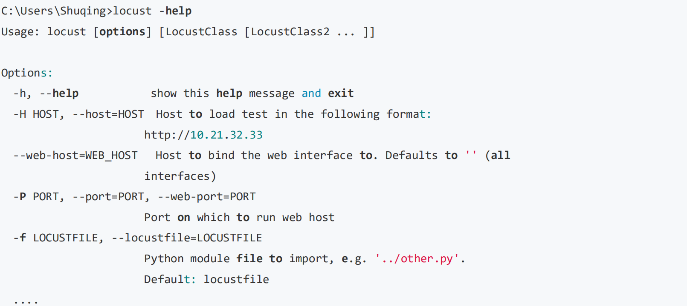

---

## 测试案例
### 测试场景

针对如下两个接口进行性能测试：
```
http://127.0.0.1:8000/users/
http://127.0.0.1:8000/groups/
```
以上两个接口也就是我们之前项目 django_restful 的接口
负载场景
• 每秒生成 2 个用户，总共生成 60 个用户。
• 负载测试 5 分钟然后查看接口的平均响应时间。

### 脚本实现
**restful_api_locust.py
**

```
from locust import HttpLocust,TaskSet,task

class UserBehavior(TaskSet):

    @task(2)
    def test_users(self):
        self.client.get("/users/",auth=('51zxw','zxw20182018'))

    @task(1)
    def test_groups(self):
        self.client.get("/groups/",auth=('51zxw','zxw20182018'))

class WebsiteUser(HttpLocust):
    task_set = UserBehavior
    min_wait = 3000
    max_wait = 6000
```

UserBehavior 类继承 TaskSet 类，用于描述用户行为。

• @task 装饰该方法为一个事务,后面的数字表示请求比例，上面的比例为 2:1 默认都是 1:1
• test_users()方法表示一个用户行为，这里是请求 user 接口。
• test_groups()方法表示请求 group 接口。
• client.get()用于指定请求的路径。

WebsiteUser 类用于设置性能测试。

• task_set：指向一个定义的用户行为类。
• min_wait：执行事务之间用户等待时间的下界（单位：毫秒）。
• max_wait：执行事务之间用户等待时间的上界（单位：毫秒）。

### 执行测试
使用如下命令开始启动测试
```
C:\Users\Shuqing>locust -f D:\api_test\locust\restful_api_locust.py --host=http://127.0.0.1:8000
[2018-07-24 15:39:22,917] LAPTOP-8B5JADC8/INFO/locust.main: Starting web monitor at *:8089
[2018-07-24 15:39:22,917] LAPTOP-8B5JADC8/INFO/locust.main: Starting Locust 0.8.1
```
在浏览器打开 localhost:8089 可以看到如下页面：

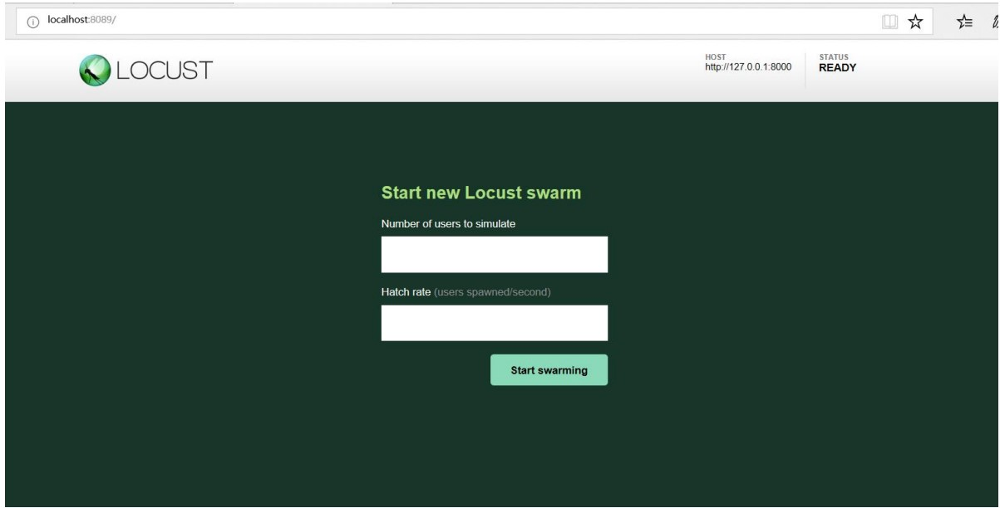

• Number of users to simulate：设置模拟用户数。
• Hatch rate（users spawned/second）：每秒产生（启动）的虚拟用户数。
• 单击“Start swarming”按钮，开始运行性能测试

运行之后可以看到主界面如下：

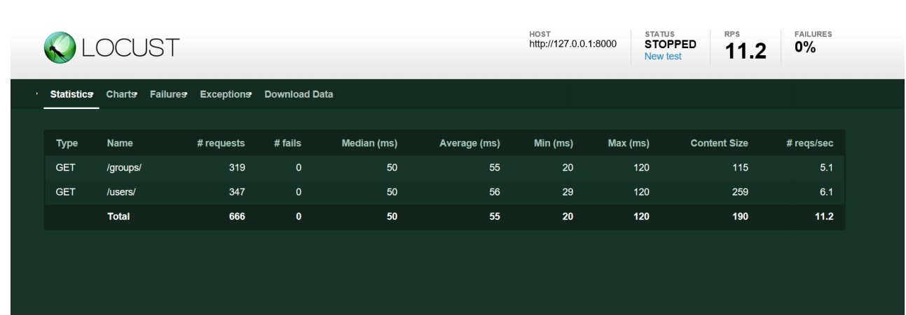

性能测试参数如下。

    • Type：请求的类型，例如 GET/POST。
    • Name：请求的路径。
    • request：当前请求的数量。
    • fails：当前请求失败的数量。
    • Median：中间值，单位毫秒，一半的服务器响应时间低于该值，而另一半高于该值。
    • Average：平均值，单位毫秒，所有请求的平均响应时间。
    • Min：请求的最小服务器响应时间，单位毫秒。
    • Max：请求的最大服务器响应时间，单位毫秒。
    • Content Size：单个请求的大小，单位字节。
    • reqs/sec：每秒钟请求的个数。
点击 Charts 菜单可以查看性能图表

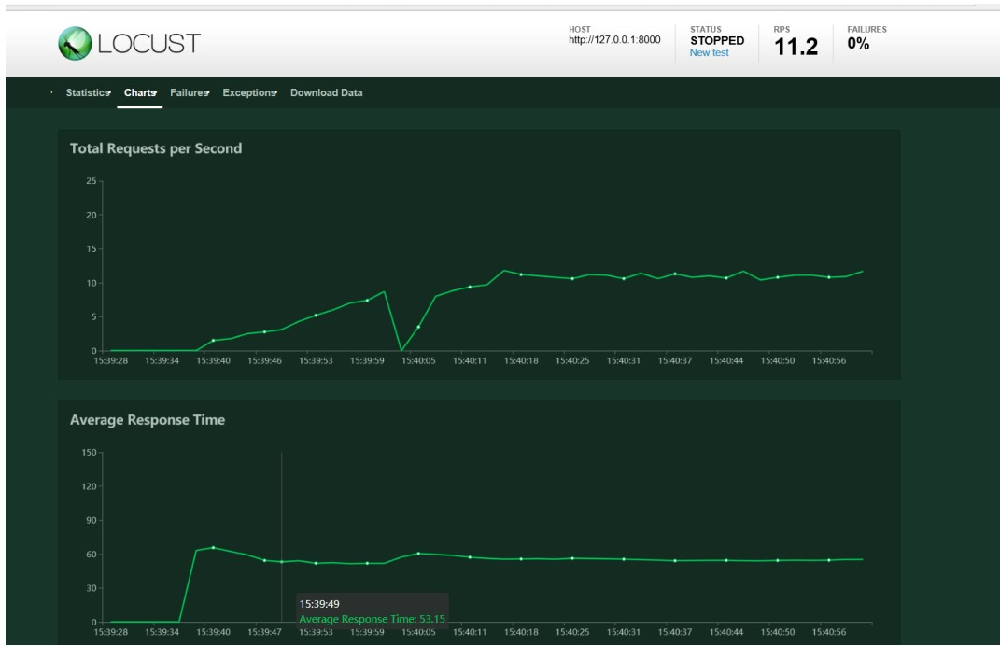

图表含义如下：
• Total Request per Second ：每秒的请求数
• Average Response Time: 平均响应时间
• Number of Users: 用户数

---

## 参数化
### 测试场景
如果想对如下接口进行并发测试，则可以将 id 进行参数化设置
```
http://127.0.0.1:8000/groups/1/
http://127.0.0.1:8000/groups/2/
http://127.0.0.1:8000/users/1/
http://127.0.0.1:8000/users/2/
```

### 代码实现

**locust_users_groups.py**

```
from locust import HttpLocust,TaskSet,task

class UserBehavior(TaskSet):

    def on_start(self):
        #设置 user 和 group 参数下标初始值
        self.users_index=0
        self.groups_index=0
    @task
    def test_users(self):
        #读取参数
        users_id=self.locust.id[self.users_index]
        url="/users/"+str(users_id)+'/'
        self.client.get(url,auth=('51zxw','zxw20182018'))
        #取余运算循环遍历参数
        self.users_index=(self.users_index+1)%len(self.locust.id)
        
    @task
    def test_groups(self):
        #参数化
        groups_id=self.locust.id[self.groups_index]
        url="/groups/"+str(groups_id)+"/"
        self.client.get(url,auth=('51zxw','zxw20182018'))
        self.groups_index=(self.groups_index+1)%len(self.locust.id)


class WebsiteUser(HttpLocust):
    task_set = UserBehavior
    #参数配置
    id=[1,2]
    min_wait = 3000
    max_wait = 6000
    #host 配置
    host = 'http://127.0.0.1:8000'
```

### 运行结果
执行如下命令即可运行测试

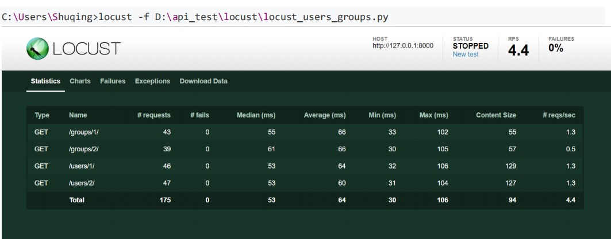

---

## 运行模式
### no-web 运行
前面是通过登录 web 来运行测试的，其实也可以非 web 状态来运行,如 cmd 命令来运行。 如果需要非 Web 形式运行，则需使用--no-web 参数，并会用到如下几个参数。

• -c, --clients：指定并发用户数；
• -r, --hatch-rate：指定并发加压速率，默认值位 1。
• -t, --run-time：设置运行时间。如(300s,20m, 3h, 1h30m 等）；

运行命令如下：
```
locust -f D:\api_test\locust\locust_users_groups.py --no-web -c 10 -r 2 -t 15s
```
运行结果如下：

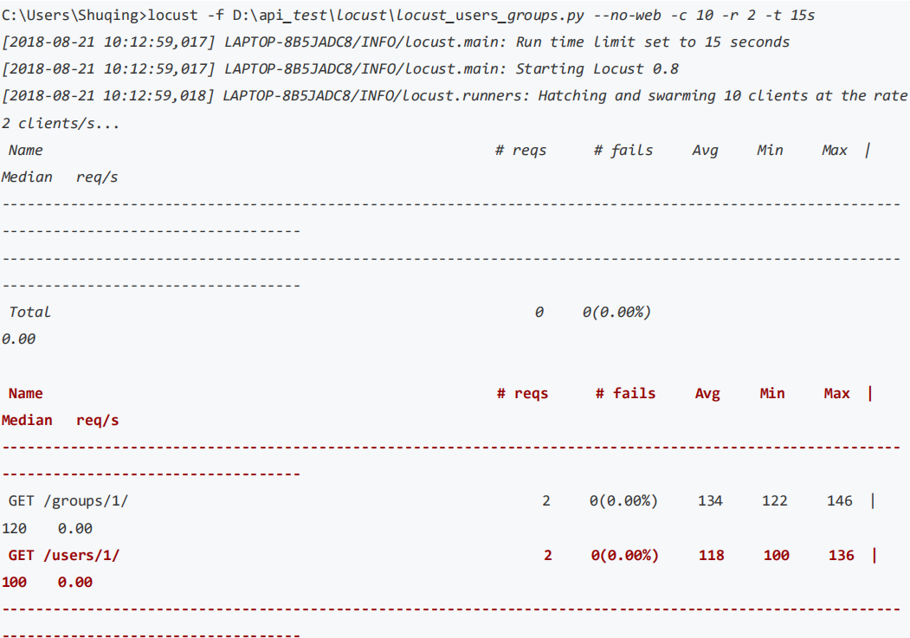
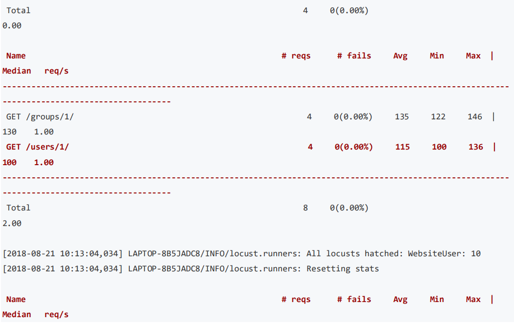

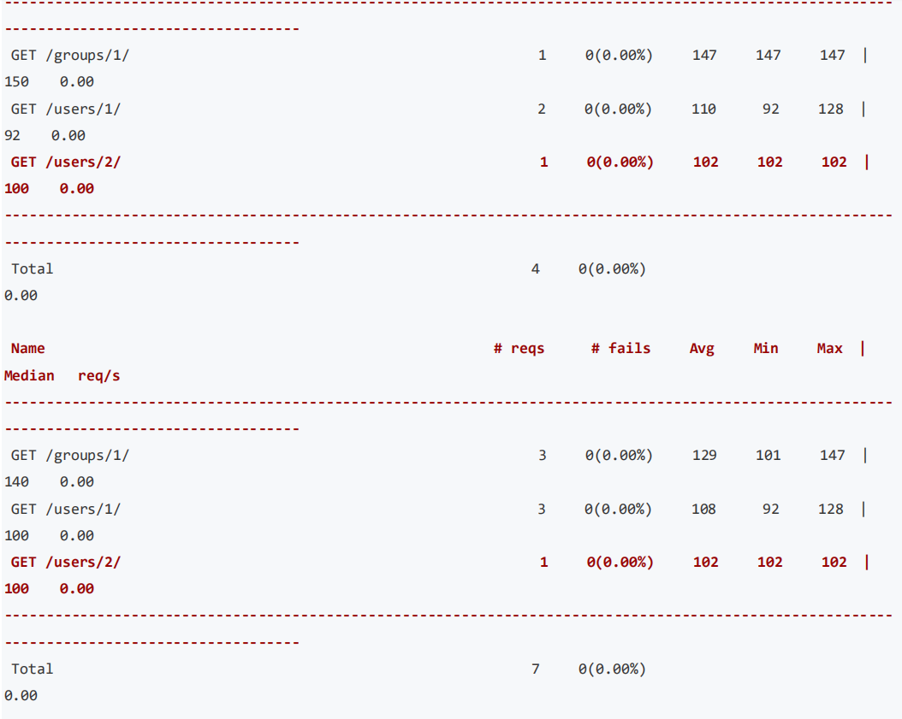
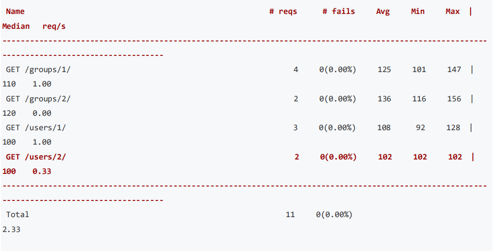

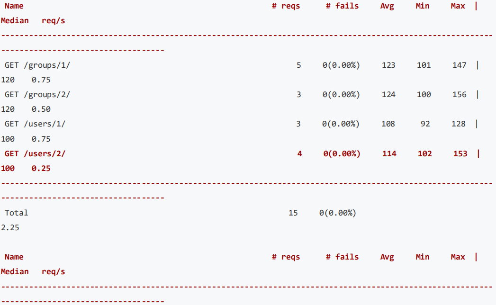
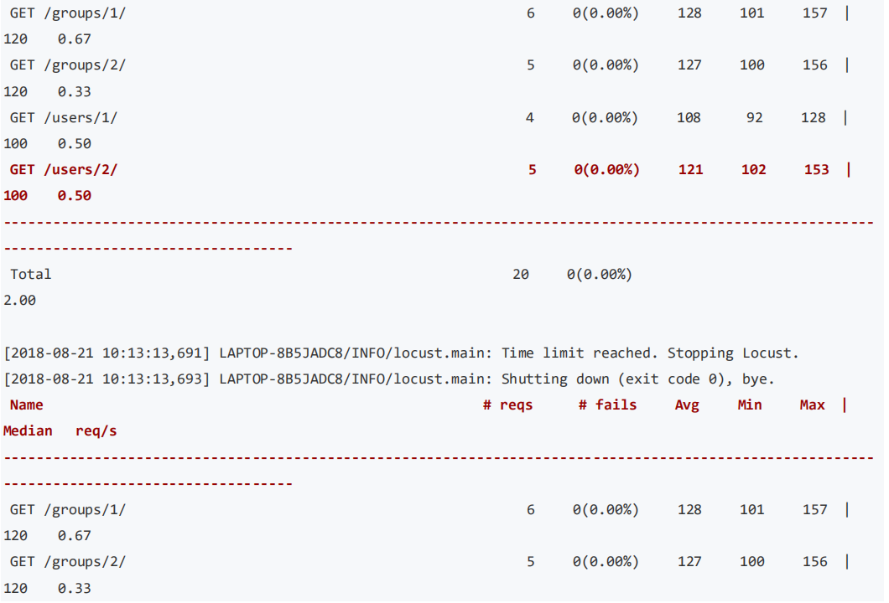
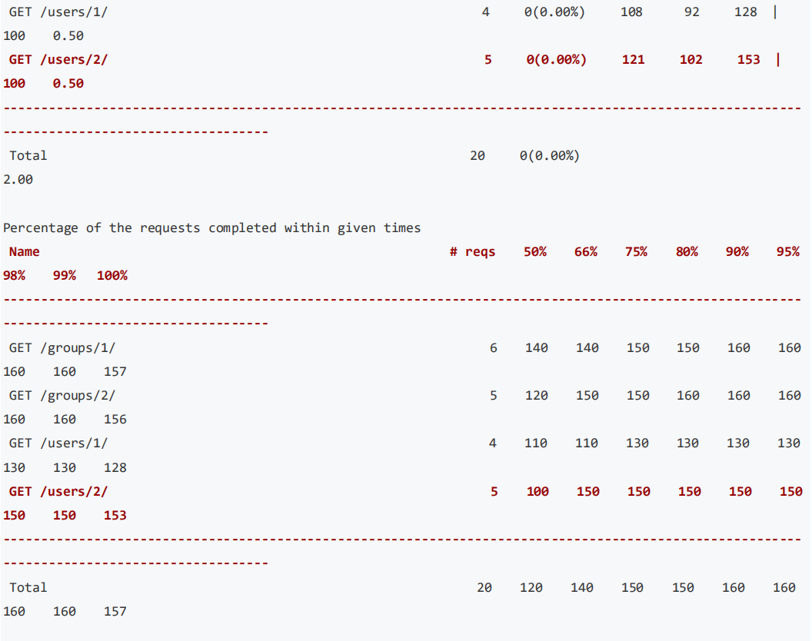


### 分布式运行
上面我们都是单台机器来执行性能测试，但是当单台机器不够模拟足够多的用户时，Locust 支持运行在多台机器
中进行压力测试。分布式运行一般是一台 master 多台 slave 如下图所示：

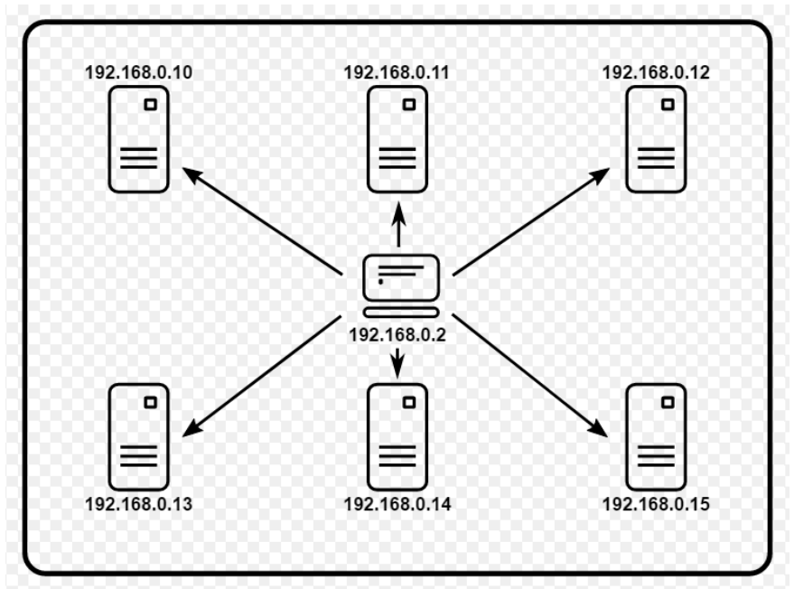

首先定义一台 master

    C:\Users\Shuqing>locust -f D:\api_test\locust\locust_users_groups.py --master
然后定义 slave

    C:\Users\Shuqing>locust -f D:\api_test\locust\locust_users_groups.py --slave
如果 slave 与 master 不在同一台机器上，还需要通过--master-host 参数再指定 master 的 IP 地址。

    C:\Users\Shuqing>locust -f D:\api_test\locust\locust_users_groups.py --slave --        master-host<master_ip></master_ip>
运行之后可以看到 web 界面显示的 SLAVES 数量


---

## 本章小结
### 内容概要
• Restful 接口概述
• Django 安装配置
•** Django Restful 接口开发
• Restful 接口测试(测试工具&Requests+unittest)**
• 接口测试数据管理(数据初始化封装)
• Swagger 接口文档
•** 日志配置
• 集成 Jenkins
• Locuts 接口性能测试**


### 学习建议
多找一些不同类型的接口来进行练习。推荐接口平台如下：
• [聚合数据](https://www.juhe.cn/)
• [极速数据](https://www.jisuapi.com/)
• [万维易源](https://www.showapi.com/)

---

## 参考资料
• https://docs.locust.io/en/stable/quickstart.html
• http://debugtalk.com/post/head-first-locust-user-guide/