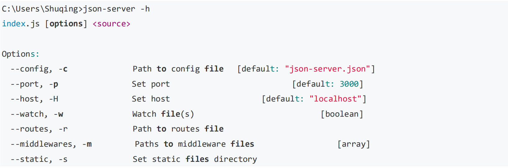
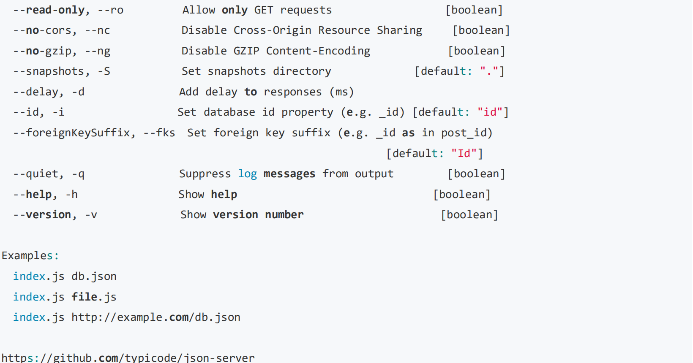
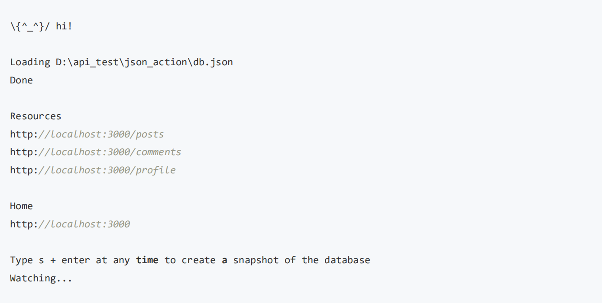
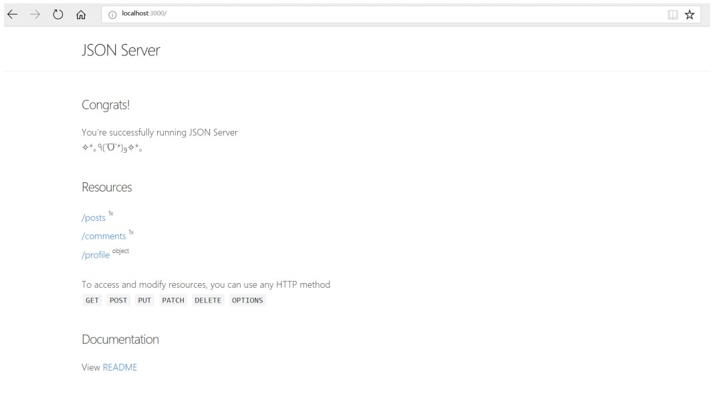
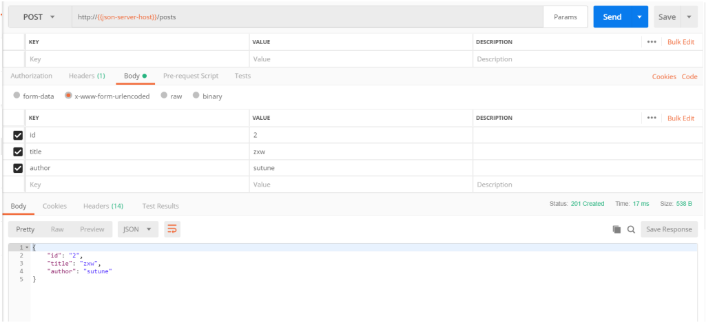
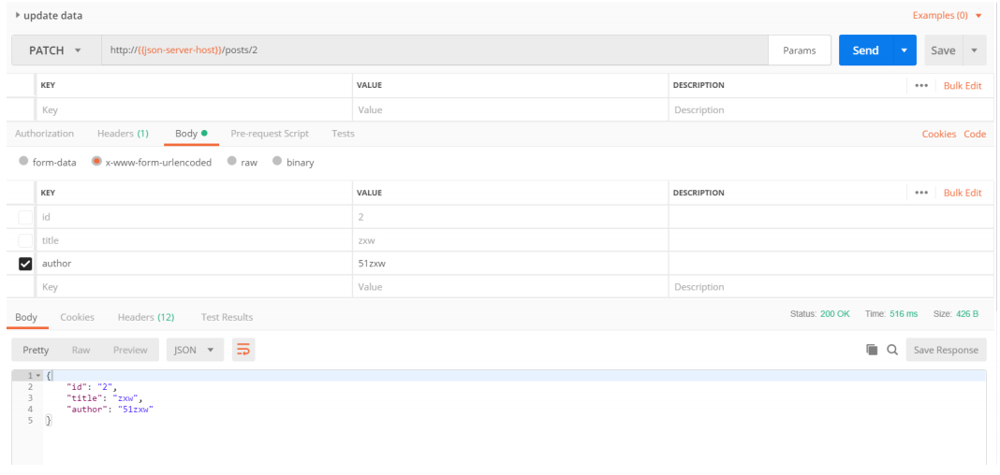
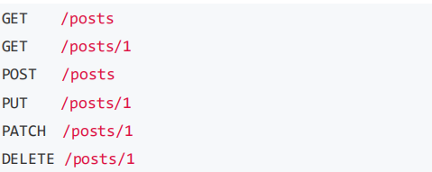
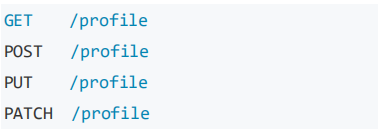

# 第6节：Mock利器——Json Server

## 什么是 Mock
Mock 在中文的含义就是模拟的意思，mock 测试就是在测试过程中，对于某些不容易构造或者不容易获取的对象，用一个虚拟的对象来创建以便测试的测试方法。

简单来说，就是通过某种技术手段模拟测试对象的行为，返回预先设计的结果。这里的关键词是预先设计，也就是说对于任意被测试的对象，可以根据具体测试场景的需要，返回特定的结果。比如要测试支付，但是你不想真实支付，那么可以 Mock 来模拟支付，返回支付的结果。

---

## Mock 作用
• 首先，Mock 可以用来解除测试对象对外部服务的依赖（比如数据库，第三方接口等），使得测试用例可以独立运行。
• 提前创建测试，TDD（测试驱动开发）。如果你创建了一个 Mock 那么你就可以在接口开发完成之前写接口测试脚本了，当接口开发完成时再替换为真实的接口进行测试即可。
• 替换外部服务调用，提升测试用例的运行速度。任何外部服务调用至少是跨进程级别的消耗，甚至是跨系统、跨网络的消耗，而 Mock 可以把消耗降低到进程内。

---

## Json Server 简介
json-server 是一款小巧的 Mock 工具，它可以不写一行代码在 30 秒内创建一套 Restful 风格的 api，适合 3 人及以下的前端团队做迅速 mock 后台逻辑，也可以在接口测试中使用。相比较 Django，flask 来实现 Mock 要方便很多。

• 主页地址：https://www.npmjs.com/package/json-server
• Github 项目地址：https://github.com/typicode/json-server

---

## Json Server 下载安装
### 环境依赖

• 首选需要安装好 [Node.js](https://nodejs.org/zh-cn/download/),
• 国内用户建议配置好：[cnpm](https://npm.taobao.org/)
• 安装配置视频教程可参考：[Appium 环境搭建](http://www.51zxw.net/show.aspx?id=69959&cid=670)

## 安装

    cnpm install -g json-server
## 校验
安装完成后输入如下命令进行校验：

    json-server -h
安装正确会提示如下内容：




---

## 入门使用
### 创建 data 文件
首先创建一个 json 文件：db.json 内容如下：
```
{
"posts": [
    { "id": 1, "title": "json-server", "author": "typicode" }
],
"comments": [
    { "id": 1, "body": "some comment", "postId": 1 }
],
"profile": { "name": "typicode" }
}
```

### 启动服务

    C:\Users\Shuqing>json-server --watch D:\api_test\json_action\db.json
启动成功后可以看到如下提示：




### 接口测试
在浏览器输入 http://localhost:3000 可以进入到主页。




#### 查询
输入 http://localhost:3000/posts 可以查看到对应的返回值：
```
[
 {
    "id": 1,
    "title": "json-server",
    "author": "typicode"
 }
]
```
输入 http://localhost:3000/posts/1 可以查看到如下返回值：
```
{
 "id": 1,
 "title": "json-server",
 "author": "typicode"
}
```

#### 增加
使用 POST 请求可以增加数据，例如我们在 Postman 中进行如下配置



可以看到成功插入了数据。

#### 修改
使用 PATCH 或者 PUT 可以对数据更新，例如如下配置，即可修改 author 数据。



#### 删除
使用 DELETE 可以删除数据，例如 请求 http://{{json-server-host}}/posts/3，则会删除 id=3 的数据

### 路由生成
根据上面的 data 文件，默认情况下 json-server 会生成两类路由：

复数路由



单数路由



---

## 接口调试
首先创建 db.json 数据内容如下：

```
{
 "posts": [
 {
   "id": 1,
   "title": "json-server",
   "author": "typicode"
 },
 {
   "id": 2,
   "title": "zxw",
   "author": "sutune"
 },
 {
   "id": 3,
   "title": "zxw666",
   "author": {"name":"jack"}
 },
 {
   "id": 4,
   "title": "zxw888",
   "author": "Bob"
 }
],
 "comments": [
 {
   "id": 1,
    "body": "some comment",
   "postId": 1
 },
 {
   "id": 2,
   "body": "hello 51zxw",
   "postId": 2
 },
 {
   "id": 3,
   "body": "hello zxw2018",
   "postId": 3
 }
],
 "profile": {
   "name": "typicode"
 }
}


```

### 过滤
使用查询字符串参数（Query String Parameters）可以查询对应的数据
```
GET /posts?id=1&id=2
GET /posts?title=zxw
```
指定过滤字段，使用.号可以查询更深层次属性
```
GET /posts?author.name=jack
```
详见视频操作演示

### 分页
分页也是常用功能，使用_page 指定第几页，_limit 指定返回的数据条数。默认是一页显示 10 条数据。
```
GET /posts?_page=1
GET /posts?_page=1&_limit=2
```

### 排序
_sort 表示排序字段，_order 表示具体的排序方式，默认是升序:asc 降序为：desc。
```
GET /posts?_sort=id&_order=asc #升序
GET /posts?_sort=id&_order=desc #降序
```

多字段组合排序

    GET /posts?_sort=para1,para2&_order=desc,asc

### 切片
切片与字符串数组切片类似，可以返回指定范围长度的数据内容，起始下标为 0

• _start 指定纪录起始点，包含起点
• _end 指定终点，不包含终点
• _limit 指定返回的数量

```
GET /posts?_start=0&_end=3
GET /comments?_start=0&_end=2
GET /posts?_start=0&_limit=2
```

### 操作
• _gte: 大于
• _lte: 小于
• _ne: 不等于
• _like: 有点像 sql 的 like，支持正则表达式
```
GET /posts?id_gte=2&id_lte=3
GET /posts?id_ne=3
GET /posts?title_like=zxw
```

### 全局搜索

使用 q 参数，比如
```
GET /comments?q=zxw
```

### 查看 db
GET /db

---

## 参考资料
• https://baike.baidu.com/item/mock 测试/5300937?fr=aladdin
• https://blog.csdn.net/eMac/article/details/71056826
• https://www.npmjs.com/package/json-server
• http://www.testclass.net/json_server/query/