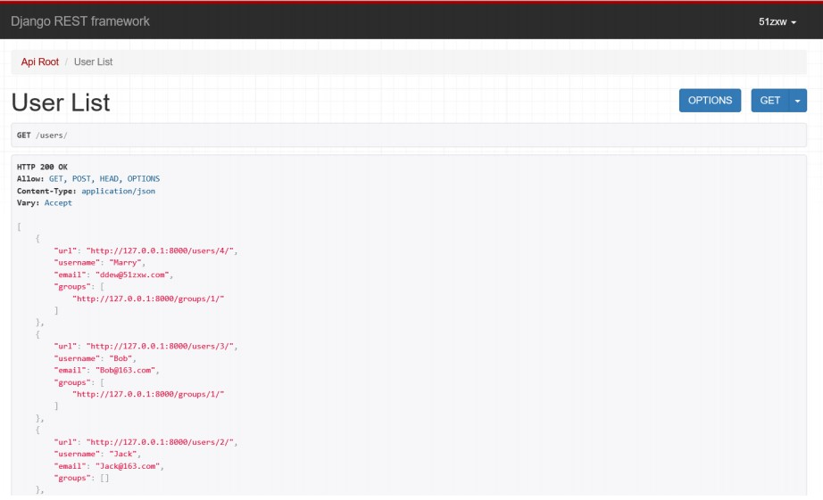
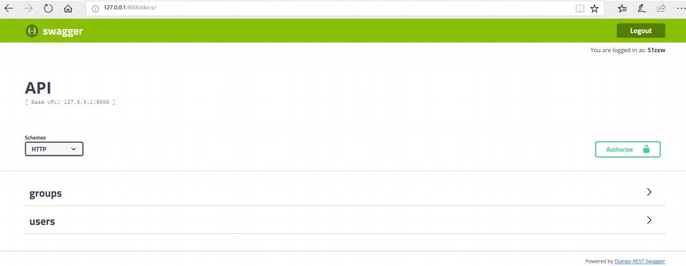
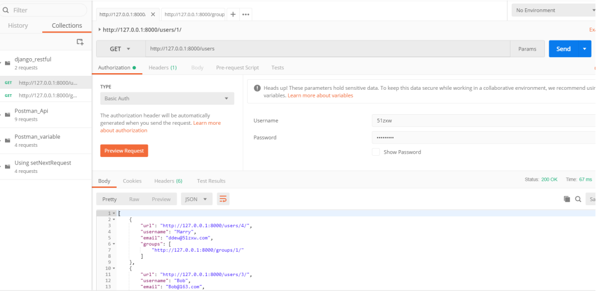
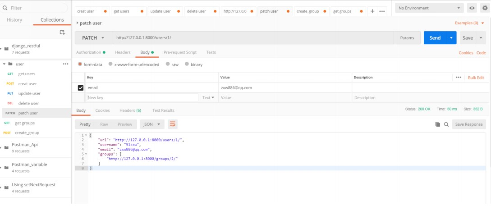
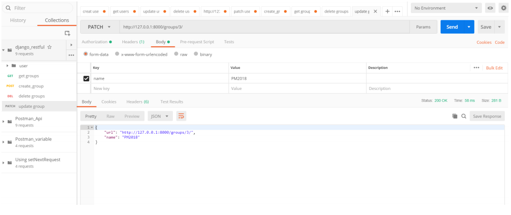
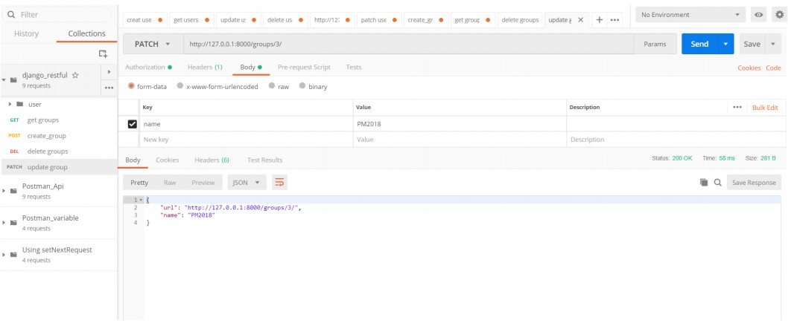

# 第3节：Restful接口开发与测试

## Rest 概述
### 简介

• REST 是英文 Representational State Transfer(表现层状态转化)，Rest 是 web 服务的一种架构风格;
• 使用 HTTP,URI、XML、JSON、HTML 等广泛流行的标准和协议;轻量级,跨平台、跨语言的架构设计;
• 它是一种设计风格,不是一种标准,是一种思想。

### Rest 原则
• 网络上的所有事物都可以被抽象为资源(resource)。
• 每一个资源都有唯一的资源标识(resource identifier)，对资源的操作不会改变这些标识
• 所有的操作都是无状态的。


### 设计思想
REST 简化开发，其架构遵循 CRUD 原则，该原则告诉我们对于资源(包括网络资源)只需要四种行为：创建，获取，
更新和删除就可以完成相关的操作和处理。
我们可以通过统一资源标识符（Universal Resource Identifier，URI）来识别和定位资源，并且针对这些资源而
执行的操作是通过 HTTP 规范定义的。其核心操作只有 GET,POST,PUT,DELETE。也就是：**URL 定位资源，用 HTTP动词（GET,POST,DELETE,DETC）描述操作。**

因此设计 web 接口的时候，REST 主要是用于定义接口名，接口名一般是用名次写，不用动词，那怎么表达“获取”
或者“删除”或者“更新”这样的操作呢——用**请求类型**（GET,PUT,POST,DELETE）来区分。

### 案例
比如我们设计一个用户管理系统的接口，如果不使用 Restful 风格，接口会定义如下：

```
http://127.0.0.1/user/query/1  #根据用户 id 查询用户数据 GET 请求
http://127.0.0.1/user/adduser #新增用户 Post 请求
http://127.0.0.1/user/update #修改用户信息 PUT 请求
http://127.0.0.1/user/delete #删除用户信息 DELETE 请求
```
从上面的定义接口来看貌似没有什么问题，但是仔细揣测就会发现有一些瑕疵：比如查询方法定义接口使用了 query动词，而 GET 请求本身的含义也就是从服务器获取资源，带有查询的含义，如果接口里面定义又加上这样的动词显得重复，同理其他几个接口也是一样的。
而使用 Rest 接口定义如下：

```
http://127.0.0.1/user/1  #GET 根据用户 id 查询用户数据
http://127.0.0.1/user #POST 新增用户
http://127.0.0.1/user #PUT 修改用户信息
http://127.0.0.1/user #DELETE 删除用户信息
```

从上面定义的接口我们可以看出，接口名称主要指向 user 资源，具体的资源操作（增删改查）由 HTTP 的请求类型来定义。这样接口名称显得统一整洁，就不用定义不同的接口名称。 遵循这样一种风格的 Reset 接口就叫做**Restful**。

---

### HTTP 方法幂等性与安全性


• 幂等：对同一 Rest 接口多次请求，得到的资源状态是相同的。
• 安全：对该 Rest 接口请求，不会使服务器资源状态发生改变。

### Rest 优势
由于 REST 强制所有的操作都必须是无状态的，这就没有上下文的约束，如果做分布式，集群都不需要考虑上下文和会话保持的问题。极大的提高系统的可伸缩性。

前后端分离。前端拿到数据只负责展示和渲染，不对数据做任何处理。后端处理数据并以 JSON 格式传输出去，定义这样一套统一的接口，在 web，ios，android 三端都可以用相同的接口。

---

## Django 接口开发
### Django 简介
Django 是一个开放源代码的 Web 应用框架，由 Python 写成。采用了 MVC 的框架模式，即模型 M，视图 V 和控制器 C。它最初是被开发来用于管理劳伦斯出版集团旗下的一些以新闻内容为主的网站的，即是 CMS（内容管理系统）软件。并于2005年7月在BSD许可证下发布。这套框架是以比利时的吉普赛爵士吉他手Django Reinhardt来命名的。

• 官网地址：https://www.djangoproject.com 
• 官方文档(中文)：https://docs.djangoproject.com/zh-hans/2.0/ 

Tips：Python 的 Web 开发框架除了 Django，还有 Flask 和 Tornado 等。


### Django 安装 
输入如下命令即可安装 Django，注意需要提前配置好 Python 环境，这里选择的 django 版本是 2.0.3 版本，
```
pip install django
```
安装校验：在 Windows 命令提示符下输入 django-admin 命令回车。
提示如下内容则说明安装成功

```
C:\Users\Shuqing>django-admin
Type 'django-admin help <subcommand>' for help on a specific subcommand.</subcommand>
Available subcommands:
[django]
    check
    compilemessages
    createcachetable
    dbshell
    diffsettings
    dumpdata
    flush
    inspectdb
    loaddata
    makemessages
    makemigrations
    migrate
    runserver
    sendtestemail
    shell
    showmigrations
    sqlflush
    sqlmigrate
    sqlsequencereset
    squashmigrations
    startapp
    startproject
    test
    testserver
Note that only Django core commands are listed as settings are not properly configured (error: Requested setting
INSTALLED_APPS, but settings are not configured. You must either define the environment variable
DJANGO_SETTINGS_MODULE or call settings.configure() before accessing settings.)
```

---

## Django REST Framework
### 简介
Django REST Framework，是一套基于 Django 的 REST 风格的框架。

官方主页：http://www.django-rest-framework.org

### 特点
• 功能强大、灵活，可以帮助你快速开发 Web API。
• 支持认证策略，包括 OAuth1 和 OAuth2。
• 支持 ORM(对象关系映射)和非 ORM 数据源的序列化。
• 丰富的文档以及良好的社区支持。

### 安装

```
pip install djangorestframework #Django REST Framework
pip install markdown # Markdown support for the browsable API.
pip install django-filter # Filtering support
```

### 创建 API
### 项目创建
当 Django REST Framework 安装好之后，创建一个新的项目 django_restful，如下命令所示我是创建在 D 盘根目录。在项目下创建 api 应用

```
C:\Users\Shuqing>d:
#创建一个新的项目
D:\>django-admin startproject django_restful
```

进入项目 django_restful 创建 api 应用,创建完成之后可以看到项目文件夹下面多了一个 api 文件夹

```
D:\>cd django_restful
D:\django_restful>python manage.py startapp api
```
进入到 D:\django_rest\django_restful 目录，打开 settings.py 在项目下创建 api 和 rest_framework。

```
INSTALLED_APPS = [
    'django.contrib.admin',
    'django.contrib.auth',
    'django.contrib.contenttypes',
    'django.contrib.sessions',
    'django.contrib.messages',
    'django.contrib.staticfiles',
    'rest_framework',
    'api',
]
```

rest_framework 权限配置

默认的权限策略可以设置在全局范围内，通过 DEFAULT_PERMISSION_CLASSES 设置。在该文件末尾添加如下容：

```
REST_FRAMEWORK = {
    'DEFAULT_PERMISSION_CLASSES': (
        'rest_framework.permissions.IsAuthenticated',
    )
}

```


### 数据库迁移
然后通过命令 migrate 命令进行数据库迁移。
```
D:\django_restful>python manage.py migrate
```
执行之后看到如下提示说明迁移成功
```
Operations to perform:
Apply all migrations: admin, auth, contenttypes, sessions
Running migrations:
Applying contenttypes.0001_initial... OK
Applying auth.0001_initial... OK
Applying admin.0001_initial... OK
Applying admin.0002_logentry_remove_auto_add... OK
Applying contenttypes.0002_remove_content_type_name... OK
Applying auth.0002_alter_permission_name_max_length... OK
Applying auth.0003_alter_user_email_max_length... OK
Applying auth.0004_alter_user_username_opts... OK
Applying auth.0005_alter_user_last_login_null... OK
Applying auth.0006_require_contenttypes_0002... OK
Applying auth.0007_alter_validators_add_error_messages... OK
Applying auth.0008_alter_user_username_max_length... OK
Applying auth.0009_alter_user_last_name_max_length... OK
Applying sessions.0001_initial... OK
```

### 创建超级管理员
使用 createsuperuser 命令来创建超级管理员账户，密码至少 8 位数字和字母组合。如 51zxw20182018
```
D:\django_rest>python manage.py createsuperuser
Username (leave blank to use 'shuqing'): 51zxw
Email address: 51zxw@163.com
Password:
Password (again):
Superuser created successfully.

```

### 启动 Server

启动 django，然后验证登录我们创建的超级管理员账户。

```
D:\django_rest>python manage.py runserver
Performing system checks...

System check identified no issues (0 silenced).
July 20, 2018 - 16:01:39
Django version 2.0.7, using settings 'django_rest.settings'
Starting development server at http://127.0.0.1:8000/
Quit the server with CTRL-BREAK.
```

启动成功之后，输入地址:http://127.0.0.1:8000/ 我们可以看到如下页面：


Tips：也可以自定义 host 和 port,如下所示：
```
python manage.py runserver 127.0.0.1:8001
```

### 登录超级管理员账户

我们再输入地址：http://127.0.0.1:8000/admin 即可进入到登录超级管理员账户界面：


登录我们创建的账户，可以看到如下界面：


### 数据序列化

Serializers 用于定义 API 的表现形式，如返回哪些字段、返回怎样的格式等。这里序列化 Django 自带的 User 和
Group。创建数据序列化，在 api 应用下创建 serializers.py 文件。


序列化代码如下：

**serializers.py**

```
from django.contrib.auth.models import User,Group
from rest_framework import serializers

class UserSerializer(serializers.HyperlinkedModelSerializer):
    class Meta:
        model=User
        fields=('url','username','email','groups')
        
class GroupSerializer(serializers.HyperlinkedModelSerializer):
    class Meta:
        model=Group
        fields=('url','name')
```

### 创建视图
视图用于如何向用户展示数据，展示哪些数据。比如用户查询 User 信息或查询 Group 信息，那么程序内部要定义好
怎么去查询。在 Django REST framework 中，ViewSets 用于定义视图的展现形式，例如返回哪些内容，需要做哪
些权限处理。


打开 api 应用下的 views.py 文件，编写如下代码:

**views.py**

```
from django.shortcuts import render
from django.contrib.auth.models import User,Group
from rest_framework import viewsets
from api.serializers import UserSerializer,GroupSerializer

# Create your views here.
class UserViewSet(viewsets.ModelViewSet):
    queryset = User.objects.all()
    serializer_class = UserSerializer

class GroupViewSet(viewsets.ModelViewSet):
    queryset = Group.objects.all()
    serializer_class = GroupSerializer
```


在 URL 中会定义相应的规则到 ViewSets。ViewSets 则通过 serializer_class 找到对应的 Serializers。
这里将 User 和 Group 的所有对象赋予 queryset，并返回这些值。在 UserSerializer 和 GroupSerializer 中定义要返回的字段。

### URL 路由配置

打开.../django_rest/urls.py 文件，添加 api 的路由配置。

```
from django.contrib import admin
from django.urls import path
from django.conf.urls import include
from rest_framework import routers
from api import views

router=routers.DefaultRouter()
router.register(r'users',views.UserViewSet)
router.register(r'groups',views.GroupViewSet)


urlpatterns = [
    path('admin/', admin.site.urls),
    path('',include(router.urls)),
    path('api-auth/',include('rest_framework.urls',namespace='rest_framework')),
]

```

注意：Django1.0 和 2.0 关于路由配置写法有一些区别,使用 1.0 路由配置如下

```
from django.conf.urls import url

urlpatterns = [
    url(r'^admin/', admin.site.urls),
    url(r'^',include(router.urls)),
    url(r'^api-auth/',include('rest_framework.urls',namespace='rest_framework')),
]
```


### 打开 API 主页

启动服务，然后在浏览器打开：http://127.0.0.1:8000/ 即可看到 API 主页，如下所示：


### 创建数据

点击主页右上角的 Log in 登录超级管理员账户，然后分别创建 Group 和 User 数据。



Tips: Vary: Accept 标头可告诉代理服务器缓存两种版本的资源：压缩和非压缩，这有助于避免一些公共代理不能
正确地检测 Content-Encoding 标头的问题。


---

## Swagger 接口文档生成
接口开发完成了，那么接下来需要编
写接口文档。传统的接口文档编写都是使用 Word 或者其他一些接口文档管理
平台，这种形式接口文档维护更新比较麻烦，每次接口有变动时得手动修改文档。因此，针对这种情况，这里推荐
使用 **Swagger** 来管理接口文档。

### Swagger 简介
[Swagger](https://swagger.io/) 是一个规范和完整的框架，用于生成、描述、调用和可视化 RESTful 风格的 Web 服务。总体目标是使客户端和文件系统(源代码)作为服务器以同样的速度来更新。每当接口有变动时，对应的接口文档也会自动更新。

Tips：(http://httpbin.org/#/) 也是利用 Swagger 生成接口文档。

Swagger 能成为最受欢迎的 REST APIs 文档生成工具之一，有以下几个原因：
    • Swagger 可以生成一个具有互动性的 API 控制台，开发者可以用来快速学习和尝试 API。
    • Swagger 可以生成客户端 SDK 代码用于各种不同的平台上的实现。
    • Swagger 文件可以在许多不同的平台上从代码注释中自动生成。
    • Swagger 有一个强大的社区，里面有许多强悍的贡献者。


### Django 接入 Swagger
首先安装 django-rest-swagger
```
pip install django-rest-swagger
```

进入到 setting.py 文件，添加 django-rest-swagger 应用

```
# Application definition
INSTALLED_APPS = [
    'django.contrib.admin',
    'django.contrib.auth',
    'django.contrib.contenttypes',
    'django.contrib.sessions',
    'django.contrib.messages',
    'django.contrib.staticfiles',
    'rest_framework',
    'api',
    'rest_framework_swagger',
]

```
进入到 views.py 将之前定义的 UserViewSet 和 GroupViewSet 补充注释：

```
from django.contrib.auth.models import User,Group
from rest_framework import viewsets
from api.serializers import UserSerializer,GroupSerializer


# Create your views here.
class UserViewSet(viewsets.ModelViewSet):
    """
        retrieve:
            Return a user instance.
            
        list:
            Return all users, ordered by most recently joined.
            
        create:
            Create a new user.
            
        delete:
            Remove an existing user.
            
        partial_update:
            Update one or more fields on an existing user.
            
        update:
            Update a user.
    """
 queryset = User.objects.all()
 serializer_class = UserSerializer

class GroupViewSet(viewsets.ModelViewSet):
    """
        retrieve:
        Return a group instance.

        list:
            Return all groups, ordered by most recently joined.
            
        create:
            Create a new group.
            
        delete:
            Remove an existing group.
            
        partial_update:
            Update one or more fields on an existing group.
            
        update:
            Update a group.
    """
 queryset = Group.objects.all()
 serializer_class = GroupSerializer

```

在 urls.py 添加 get_schema_view 辅助函数

```
from rest_framework.schemas import get_schema_view
from rest_framework_swagger.renderers import SwaggerUIRenderer,OpenAPIRenderer

schema_view=get_schema_view(title='API',renderer_classes=[OpenAPIRenderer,SwaggerUIRenderer])

urlpatterns = [
    path('admin/', admin.site.urls),
    path('',include(router.urls)),
    path('api-auth/',include('rest_framework.urls',namespace='rest_framework')),
    path('docs/',schema_view,name='docs')
]
```

启动服务，然后打开地址：http://127.0.0.1:8000/docs/ 即可看到如下界面：



分别点击 groups 和 users 即可看到自动生成的接口文档。


---


## Restful 接口测试
开发完接口，接下来我们需要对我们开发的接口进行测试。接口测试的方法比较多，使用接口工具或者 Python 来
测试都可以，工具方面比如之前我们学习过的 Postman 或者 Jmeter ，Python 脚本测试可以使用 Requests + unittest来测试。

### 测试思路
• 功能测试：数据的增删改查
• 异常测试：未授权，参数异常等

### Postman 测试
使用测试工具 Postman 测试结果如下所示：

#### user 接口测试
查询所有用户



创建用户


修改用户



删除用户


未授权测试




#### groups 接口测试

查询所有 groups 数据


修改 group 数据




删除 groups


### Requests+Unittest

在 api 目录下面新建一个 test_unittest.py，代码实现如下:

**tests_unittest.py
**

```
import requests
import unittest

class UserTest(unittest.TestCase):
    def setUp(self):
        self.base_url='http://127.0.0.1:8000/users'
        self.auth=('51zxw','zxw20182018')
    
    def test_get_user(self):
        r=requests.get(self.base_url+'/1/',auth=self.auth)
        result=r.json()
        
        self.assertEqual(result['username'],'51zxw')
        self.assertEqual(result['email'],'51zxw@163.com')
        
    def test_add_user(self):
        form_data={'username':'zxw222','email':'zxw668@qq.com','groups':'http://127.0.0.1:8000/groups/2/'}
        r=requests.post(self.base_url+'/',data=form_data,auth=self.auth)
        result=r.json()

        self.assertEqual(result['username'],'zxw222')
    
    def test_delete_user(self):
        r=requests.delete(self.base_url+'/11/',auth=self.auth)
        
        self.assertEqual(r.status_code,204)
    
    def test_update_user(self):
        form_data={'email':'2222@163.com'}
        r=requests.patch(self.base_url+'/2/',auth=self.auth,data=form_data)
        result=r.json()
        
        self.assertEqual(result['email'],'2222@163.com')
    
    def test_no_auth(self):
        r=requests.get(self.base_url)
        result=r.json()
        
        self.assertEqual(result['detail'],'Authentication credentials were not provided.')
        
        
class GroupTest(unittest.TestCase):
    def setUp(self):
        self.base_url='http://127.0.0.1:8000/groups'
        self.auth=('51zxw','zxw20182018')

    def test_group_developer(self):
        r=requests.get(self.base_url+'/7/',auth=self.auth)
        result=r.json()
        
        self.assertEqual(result['name'],'Developer')
    
    def test_add_group(self):
        form_data={'name':'Pm'}
        r=requests.post(self.base_url+'/',auth=self.auth,data=form_data)
        result=r.json()
        
        self.assertEqual(result['name'],'Pm')

    def test_update_group(self):
        form_data={'name':'Boss'}
        r=requests.patch(self.base_url+'/6/',auth=self.auth,data=form_data)
        result=r.json()
        
        self.assertEqual(result['name'],'Boss')
    
    def test_detele_group(self):
        r=requests.delete(self.base_url+'/6/',auth=self.auth)
        
        self.assertEqual(r.status_code,204)
        
if __name__ == '__main__':
    unittest.main()

```


### Django 自带测试模块

打开 api 目录下面的 tests 文件，编写如下测试代码

**tests.py**

```

from django.test import TestCase
import requests

# Create your tests here.
class UserTest(TestCase):
    def setUp(self):
        self.base_url='http://127.0.0.1:8000/users'
        self.auth=('51zxw','xxxxx')
    
    def test_get_user(self):
        r=requests.get(self.base_url+'/1/',auth=self.auth)
        result=r.json()
        
        self.assertEqual(result['username'],'51zxw')
        self.assertEqual(result['email'],'zxw886@qq.com')
        
    # @unittest.skip('skip add user')
    def test_add_user(self):
        form_data={'username':'zxw222','email':'zxw668@qq.com','groups':'http://127.0.0.1:8000/groups/2/'}
        r=requests.post(self.base_url+'/',data=form_data,auth=self.auth)
        result=r.json()
        
        self.assertEqual(result['username'],'zxw222')
        
    # @unittest.skip('skip test_delete_user')
    def test_delete_user(self):
        r=requests.delete(self.base_url+'/11/',auth=self.auth)
        
        self.assertEqual(r.status_code,204)
        
    def test_update_user(self):
        form_data={'email':'2222@163.com'}
        r=requests.patch(self.base_url+'/2/',auth=self.auth,data=form_data)
        result=r.json()
        
        self.assertEqual(result['email'],'2222@163.com')
        
    def test_user_already_exists(self):
        form_data = {'username': 'zxw222', 'email': 'zxw668@qq.com', 'groups':
        'http://127.0.0.1:8000/groups/2/'}
        r = requests.post(self.base_url + '/', data=form_data, auth=self.auth)
        result = r.json()
        #预期返回值：{"username":["A user with that username already exists."]}
        self.assertEqual(result['username'][0], 'A user with that username already exists.')
    
    def test_no_auth(self):
        r=requests.get(self.base_url)
        result=r.json()
        
        self.assertEqual(result['detail'],'Authentication credentials were not provided.')

class GroupTest(TestCase):
    def setUp(self):
        self.base_url='http://127.0.0.1:8000/groups'
        self.auth=('51zxw','xxxxxx')
    
    def test_group_developer(self):
        r=requests.get(self.base_url+'/3/',auth=self.auth)
        result=r.json()
        
        self.assertEqual(result['name'],'Pm')
    
    # @unittest.skip('skip test_add_group')
    def test_add_group(self):
        form_data={'name':'Leader'}
        r=requests.post(self.base_url+'/',auth=self.auth,data=form_data)
        result=r.json()
        
        self.assertEqual(result['name'],'Leader')
        
    def test_update_group(self):
        form_data={'name':'Boss'}
        r=requests.patch(self.base_url+'/6/',auth=self.auth,data=form_data)
        result=r.json()

        self.assertEqual(result['name'],'Boss')
    
    def test_detele_group(self):
        r=requests.delete(self.base_url+'/6/',auth=self.auth)
        
        self.assertEqual(r.status_code,204)

```

运行方式：打开 cmd 使用如下命令来运行即可：

```
D:\django_restful>python manage.py test
```
上面命令是默认测试全部的用例，如果想测试部分用例则可以使用如下命令：

测试指定的测试类
```
D:\django_restful>python manage.py test api.tests.UserTest
```
测试具体的某一条具体用例
```
D:\django_restful>python manage.py test api.tests.UserTest.test_get_user
```

---

## 参考资料

• https://blog.csdn.net/chenxiaochan/article/details/73716617
• https://www.cnblogs.com/liang1101/p/6266305.html
• https://segmentfault.com/q/1010000009125740/a-1020000009128940
• https://baike.baidu.com/item/django/61531?fr=aladdin
• https://www.jianshu.com/p/dc77f652e7d7
• https://segmentfault.com/q/1010000005685904/