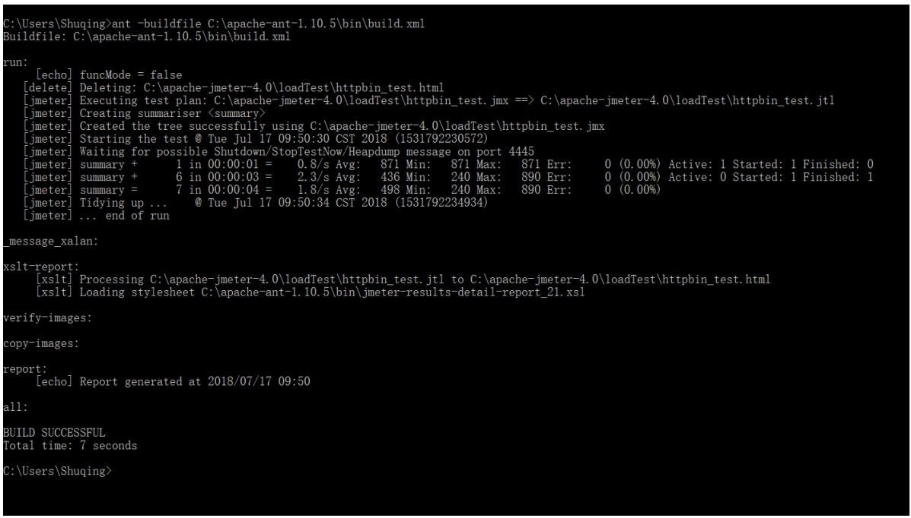
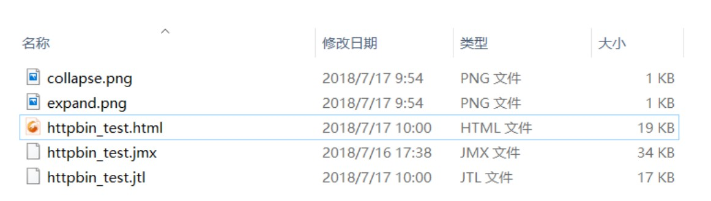
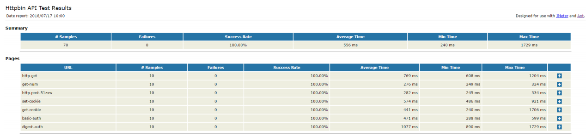
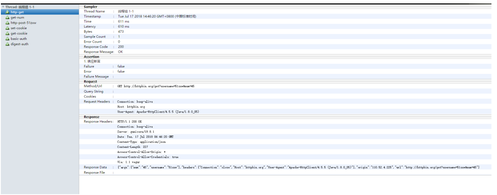
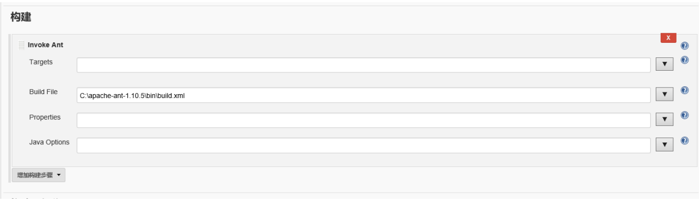
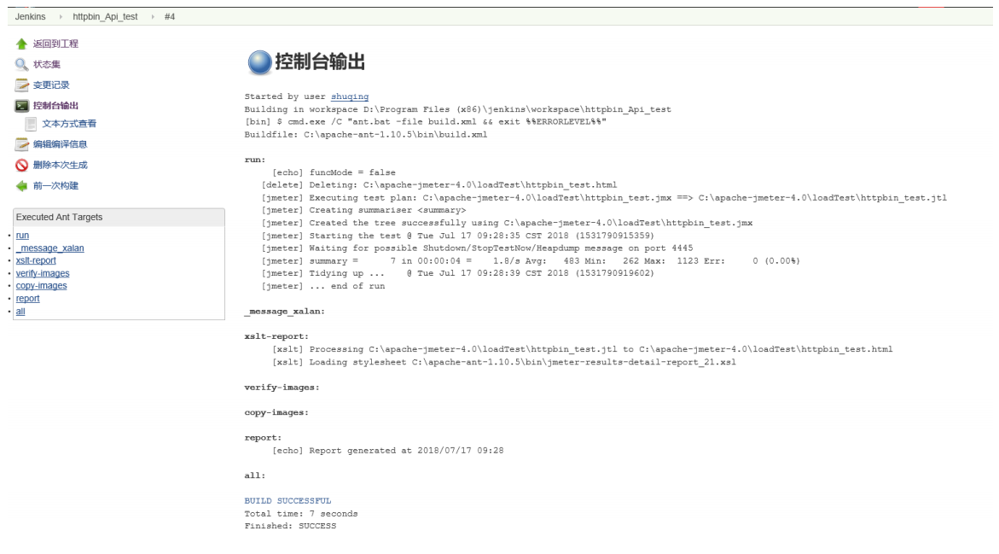
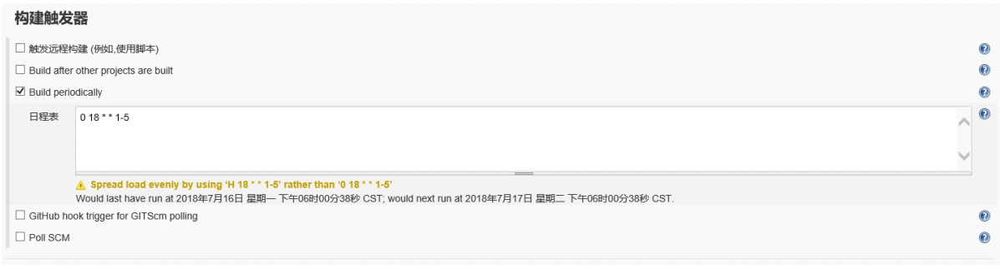

# 第3节：Jmeter+Ant+Jenkins接口自动化测试平台

## 平台简介
一个完整的接口自动化测试平台需要支持接口的自动执行，自动生成测试报告，以及持续集成。Jmeter 支持接口的
测试，Ant 支持自动构建，而 Jenkins 支持持续集成，所以三者组合在一起可以构成一个功能完善的接口自动化测
试平台。

---


## 环境准备

### 环境依赖
* JDK 环境配置

* Jmeter 安装

* Ant 安装环境变量配置

* Jenkins 安装

  ​

## Ant 简介
Apache Ant,是一个将软件编译、测试、部署等步骤联系在一起加以自动化的一个工具，大多用于 Java 环境中的软
件开发。

### 下载安装

下载地址：<https://ant.apache.org/bindownload.cgi>
下载之后解压到任意文件路径，我这里是放到 C 盘根目录。


### 环境变量配置
* ANT_HOME C:\apache-ant-1.10.5
* Path : %ANT_HOME%\bin
* ClassPath %ANT_HOME%\lib

### 配置检测

输入如下命令即可检查是否安装成功

	C:\Users\Shuqing>ant -version
	Apache Ant(TM) version 1.10.5 compiled on July 10 2018

注意：如果提示‘ant 不是内部命令也不是外部命令’ 说明环境变量可能配置错误。


### Jenkins 简介
Jenkins 是一个开源软件项目，是基于 Java 开发的一种持续集成工具，用于监控持续重复的工作，旨在提供一个开放易用的软件平台，使软件的持续集成变成可能。

### 下载与安装
下载地址：<https://jenkins.io/download/>

下载后安装到指定的路径即可，默认启动页面为 localhots:8080,如果 8080 端口被占用无法打开，可以进入到jenkins 安装目录，找到 jenkins.xml 配置文件打开，修改如下代码的端口号即可。

```
<arguments>-Xrs -Xmx256m -Dhudson.lifecycle=hudson.lifecycle.WindowsServiceLifecycle -jar
"%BASE%\jenkins.war" --httpPort=8080 --webroot="%BASE%\war"</arguments>
```

---


## 平台搭建

### 依赖文件配置
* 首先在 Jmeter 目录下面新建一个文件夹 loadTest (文件夹名称不要使用下划线，空格字符),并将 Jemter 测
  试脚本放置到该文件夹中。
* 将 Jmeter extras 文件中的 ant-jmeter-1.1.1.jar 放到 Ant 中的 lib 文件夹中
* 将 Jmeter extras 文件中的 jmeter-results-detail-report_21.xsl ,build.xml、collapse.png、expand.png 放
  到 ant 目录中的 bin 目录下面。

### build.xml 配置
在 Ant 的 bin 目录中打开 build.xml 文件找到以下内容

```
<property name="testpath" value="${user.dir}"/>
<property name="jmeter.home" value="${basedir}/.."/>
<property name="report.title" value="Load Test Results"/>
<!-- Name of test (without .jmx) -->
<property name="test" value="Test"/>
```


### 参数说明

* testpath 测试计划，这里用于存放测试脚本、测试生成的文件、测试报告
* jmeter.home Jmeter 目录路径
* report.title 测试报告的标题
* test jmeter 测试脚本的名称（无需后缀.jmx）

这里根据自己的环境修改为

```
<property name="testpath" value="C:\apache-jmeter-4.0\loadTest"/>
<property name="jmeter.home" value="C:\apache-jmeter-4.0"/>
<property name="report.title" value="Httpbin API Test Report"/>
<!-- Name of test (without .jmx) -->
<property name="test" value="httpbin_test"/>
```

### Ant 构建
执行如下命令进行构建

	ant -buildfile C:\apache-ant-1.10.5\bin\build.xml

结果如下：



进入到 loadTest 文件夹可以看到生成如下文件：



打开 html 测试报告 httpbin_test.html 报告内容如下：




### 报告优化
Jmeter 默认生成报告不是很详细，因此我们需要进行优化。这里我们使用新的报告模板：
jmeter-results-detail-report_30.xsl 默认的报告模板是 jmeter-results-detail-report_21

打开 build.xml 将 21 改为 30

	<condition property="style_version" value="_30">

补充删除 .jtl 的代码，如果不删除每次迭代的记录都会显示在报告里面，显得很冗余。
```
<target name="run">
	<echo>funcMode = ${funcMode}</echo>
	<delete file="${testpath}/${test}.html"/>
		<delete file="${testpath}/${test}.jtl"/>
```
进入 Jmeter 的 bin 目录，找到 jmeter.properties 文件打开。然后将以下代码取消注释状态，并改为 true

```
jmeter.save.saveservice.data_type=true
jmeter.save.saveservice.label=true
jmeter.save.saveservice.response_code=true
# response_data is not currently supported for CSV output
jmeter.save.saveservice.response_data=true
# Save ResponseData for failed samples
jmeter.save.saveservice.response_data.on_error=true
jmeter.save.saveservice.response_message=true
jmeter.save.saveservice.successful=true
jmeter.save.saveservice.thread_name=true
jmeter.save.saveservice.time=true
jmeter.save.saveservice.subresults=true
jmeter.save.saveservice.assertions=true
jmeter.save.saveservice.latency=true
# Only available with HttpClient4
jmeter.save.saveservice.connect_time=true
jmeter.save.saveservice.samplerData=true
jmeter.save.saveservice.responseHeaders=true
jmeter.save.saveservice.requestHeaders=true
jmeter.save.saveservice.encoding=true
jmeter.save.saveservice.bytes=true
# Only available with HttpClient4
jmeter.save.saveservice.sent_bytes=true
jmeter.save.saveservice.url=true
jmeter.save.saveservice.filename=true
jmeter.save.saveservice.hostname=true
jmeter.save.saveservice.thread_counts=true
jmeter.save.saveservice.sample_count=true
jmeter.save.saveservice.idle_time=true
```

最后执行即可生成最新的报告：样式如下，可以清晰看到每一个请求发送，响应内容。



### 注意
如果生成的报告为空，则说明 jmeter 脚本有错误，此时可以打开 jmeter 的 bin 目录中的 jmeter.log 日志文件，查看具体的报错信息。

---

### 集成到 Jenkins

在 Jenkins 新建一个任务 httpbin_Api_test
在构建选项中选择 Invoke Ant 然后在 Build File 输入 build.xml 配置文件路径。注意：不要输入到 Targets 里面去
了，需要点击高级选项后才可以显示除 Build File



执行之后可以看到控制台输出和 cmd 的控制台输出是一样的



如果想定制构建则可以在**构建触发器**中选择 Build periodically 如果想每个工作日下班 18 时执行，则可以如下设置：




扩展资料：[Appium jenkins 自动化测试平台搭建](https://www.51zxw.net/show.aspx?id=70266&cid=670)

### 邮件推送

参考 [python 邮件发送](https://www.51zxw.net/show.aspx?id=61323&cid=615)

---


## 参考资料

• https://baike.baidu.com/item/apache ant/1065741
• http://www.cnblogs.com/puresoul/p/5049433.html
• https://testerhome.com/topics/2580
• https://blog.csdn.net/yinjing8435/article/details/71159403