# 第2节：Jmeter接口测试

# Jmeter概述

---
## Jmeter简介

[Apache JMeter](https://jmeter.apache.org/)是 Apache组织的开放源代码项目,是一个纯Java桌面应用,用于压力测试和性能测试.它最初被设计用于Web应用测试但后来扩展到其它测试领域

## Jmeter功能

* 能够对HTP和FTP服务器进行压力和性能测试,也可以对任何数据库进行同样的测试(通过JDBC)。
* 完全的可移植性和100%纯java。
* 完全 Swing(ava设计的GU工具包)和轻量组件支持。
* 完全多线程框架允许通过多个线程并发取样和通过单独的线程组对不同的功能同时取样。
* 精心的GU设计允许快速操作和更精确的计时。
* 缓存和离线分析/回放测试结果。

## Jmeter接口测试

Jmeter接口测试的简单操作包括做http脚本编辑(发get/post请求cookie设置header设置、权限认证)参数化、断言、关联和数据驱动等等。


# Jmeter安装启动

## 下载安装

* [Jmeter下载地址](https://jmeter.apache.org/download_jmeter.cgi)
* [Jmeter官方文档](https://jmeter.apache.org/usermanual/get-started.html)
* [Jmeter基础教程](http://www.51zxw.net/list.aspx?page=2&cid=520)

## 说明

一般开放原代码软件都会有两个版本发布: Source和 Binary
* Source是源代码版,你需要自己编译成可执行软件。
* Binary是可执行版,直接可以拿来用的,他已经给你编译好的版本。
* 下载后,解压文件到任意目录,避免在有空格的路径安装 JMeter。
* 环境依赖:java环境,需要自行安裝配置好JK环境变量參考帖子。

## 启动软件

进入到 Imeter的bin目录,双击运行 Apache ]Meter,jar即可启动软件,如下界面
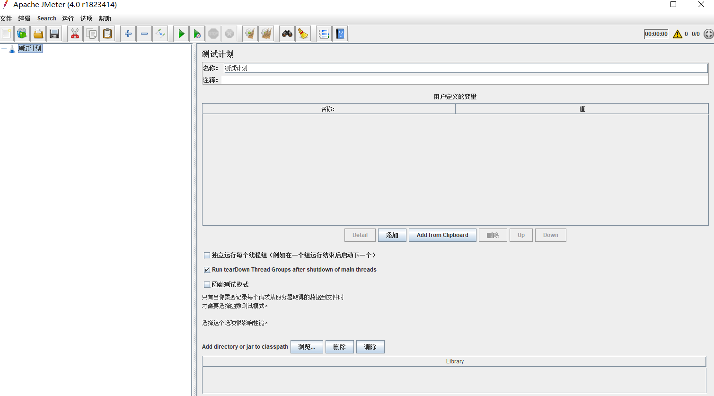

---

## Jmeter接口测试实战

Jmeter脚本编写一般分五个步骤:

1. 添加线程组
2. 添加http请求
3. 在http请求中写入接入ur、路径、请求方式和参数
4. 添加查看结果树
5. 调用接口、查看返回值

## 测试API

<http://httpbin.org/>

## 发送Get请求

请求URL如下：

    http://httpbin.org/get
在Jmeter i配置如下图所示:
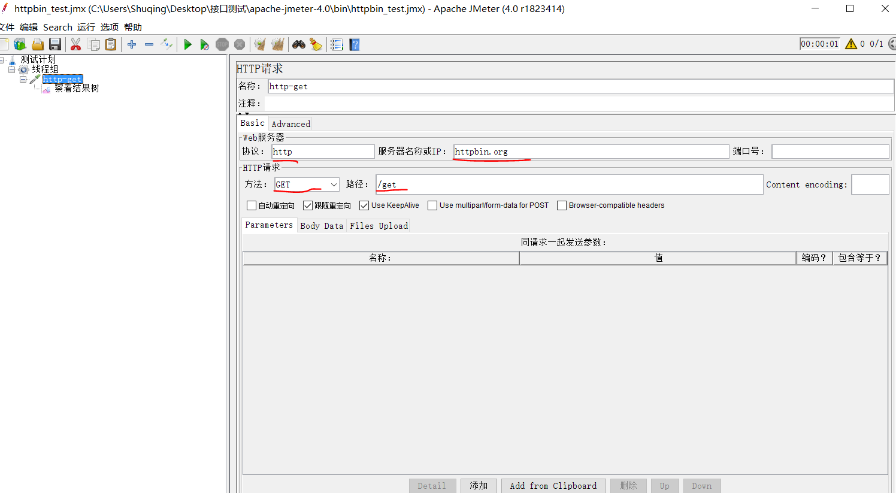


在查看结果树选择 Json Path Tester如下图所示可以看到返回结果:


## 发送POST请求
请求URL如下：

    http://httpbin.org/post

Jemeter配置如下图所示：
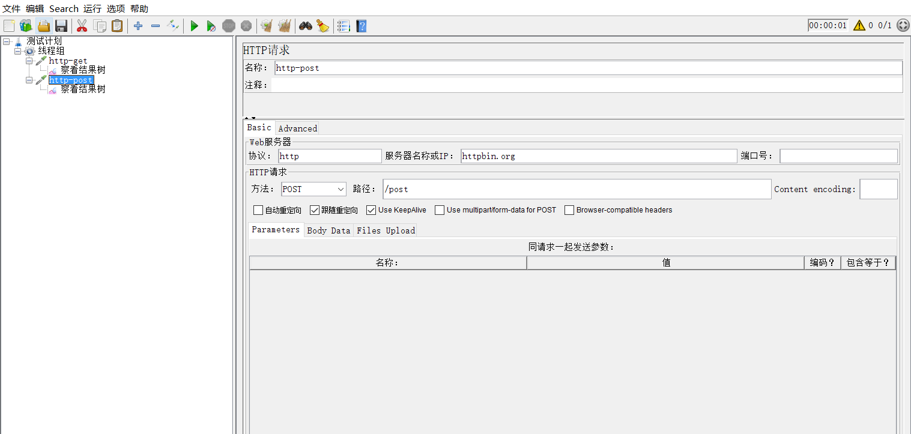

响应结果：


## HTTP请求默认值

通过上面两个请求我们发现,Web服务器中的**协议**和**服务器名称或IP**这两个值都是一样,每次重复输入其实比较麻烦,因此我们可以使用HTTP请求默认值来管理这些公共的配置数据。
添加步骤:线程组——添加——配置元件—HTTP请求默认值然后进行如下配置,并把该元件放置到请求前面。

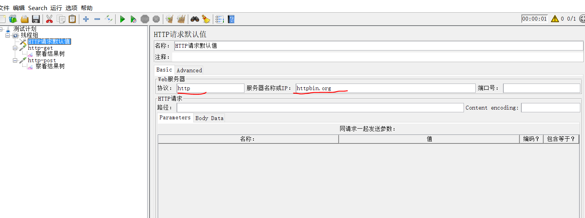

经过请求默认值的配置后,后续我们増加新的请求,如果这两项值是一样的话,那么则无需再重复填入该值。

## 断言设置

Jmeter可以针对毎一个请求响应进行断言.设置步骤选中一个请求,如http-get然后右键选择:添加—断言一响应断言。

各个匹配模式含义如下：

* 包括:响应内容包括需要匹配的内容即代表响应成功,支持正则表达式
* 匹配:响应内容要完全匹配需要匹配的内容即代表响应成功,大小写不敏感,支持正则表达式.
* Equals:响应内容要完全等于需要匹配的内容才代表成功,大小写敏感,需要匹配的内容是字符串正则表
* Substring:返回结果包含指定结果的字串,但是 subString不支持正则字符串
* 否:不进行匹配

如下图所示匹配返回的字符串是否包含http://httpbin.org/get

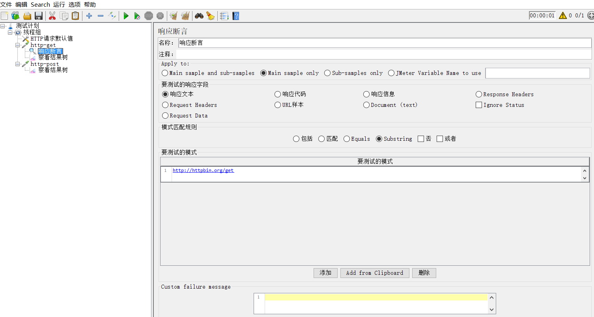

如果断言成功,则查看结果树为绿色标志,如果断言失败则为红色显示,如下图所示：

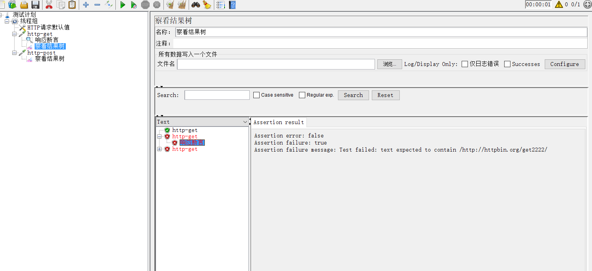


## 参数设置

Jmeter支持通过 Query String Parameters或者 Request body请求体来传递参数。


### Query String Parameters

如果希望在请求URL中添加参数,则可以在Http请求界面的 Parameters选项里面添加参数。该参数会通过 Query String Parameters方式传递给服务器,也就是在URL中传递参数.如下图如所示设置参数：

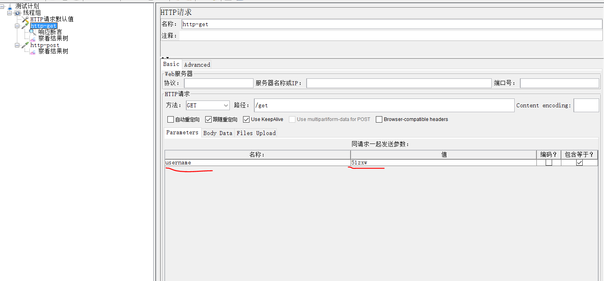

### Request body

在Post请求中参数一般在body中传递, Jmeter也支持在body中传递参数.如传递Json格式的参数,在Body pata编辑框输入如下参数：

>[username": 51ZxW"}

另外还需要指定参数的格式,因此需要添加**HTTP信息头管理器**


添加步骤：选定请求——添加——配置元件——HTTP信息头管理器,然后在管理器里面添加参数类型
Content-Type: application/json如下图所示：


## 变量

在请求过程中,有时我们需要在请求中设置一些变量来测试不同的场景。

Jmeter支持以下类型变量：

* 用户自定义变量
* 函数生成变量
* Bean Shell!变量
* 数据文件变量


### 用户自定义变量

设置步骤：选中请求——添加——前置处理器——用户参数设置变量名称为υser,值为51zxw


在请求时引用变量如下所示:变量引用格式为:${user}

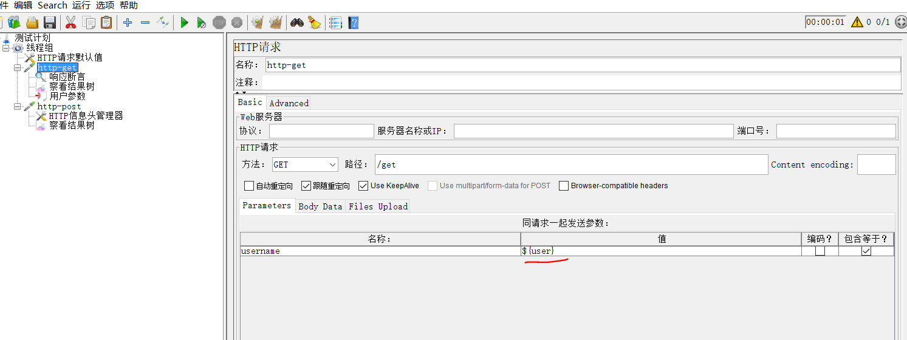


### 函数生成变量

Jmeter有许多内置的函数,可以生成随机数.创建步骤点击菜单栏选项—函数助手对话框——下拉选择_Random()函数

函数配置如下:


### Bean Shel变量

#### **什么是 Bean Shell!?**
* Bean She是一种完全符合Java语法规范的脚本语言,并且又拥有自己的一些语法和方法; 
* Bean She是一种松散类型的脚本语言这点和JS类似);
* Bean She是用Jaνa写成的一个小型的、兔费的、嵌入式的Java源代码解释器,具有对象脚本语言特性非常精简。
* Bean Shell执行标准Java语句和表达式另外包括一些脚本命令和语法。

官网http://www.beanshell.org


#### Jmeter有哪些 Bean Shel

* 定时器Bean Shell Timer
* 前置处理器: Bean Shell PreProcessor
* 采样器: Bean Shell Sampler
* 后置处理器: Bean Shell PostProcessor
* 断言:Bean Shel
* 断言监听器: Bean shell listener


### Bean Shell 常用内置变量

JMeter 在它的 BeanShell 中内置了变量，用户可以通过这些变量与 JMeter 进行交互，其中主要的变量及其使用
方法如下:
vars - (JMeterVariables)：操作jmeter变量，这个变量实际引用了JMeter线程中的局部变量容器（本质上是Map），
它是测试用例与 BeanShell 交互的桥梁，常用方法：

```
//定义 jmeter 变量
vars.put(String key，String value);
//从 jmeter 中获取变量
vars.get(String key);
```

log：写入信息到 jmeber.log 文件，使用方法：

```
log.info(“hello 51zxw!”);
```


#### BeanShell 实践案例
1.创建请求名为 beanshell_test 的 Http 请求，请求地址为：http://httpbin.org/get 同时设置传递的参数为
beanshell_user


2.创建 BeanShell PreProcessor 变量设置如下所示：


3.最后运行结果可以看到，设置的变量已经生效


### CSV 数据文件变量
CSV 数据文件变量是指从外部 csv 文件读取数据出来作为变量。
设置步骤: 选择请求——添加——配置元件——CSV 数据文件设置
创建 csv 文件（最好不用用记事本创建，推荐用 Nodepad++）文件编码为 UTF-8 文件内容如下：
user_data.csv

	51zxw,8888

CSV 数据文件设置如下：
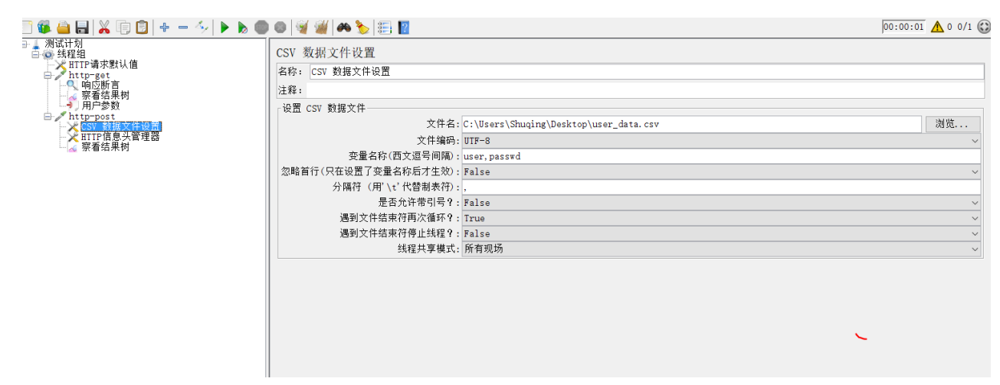

在 Post 请求中引用变量数据如下：


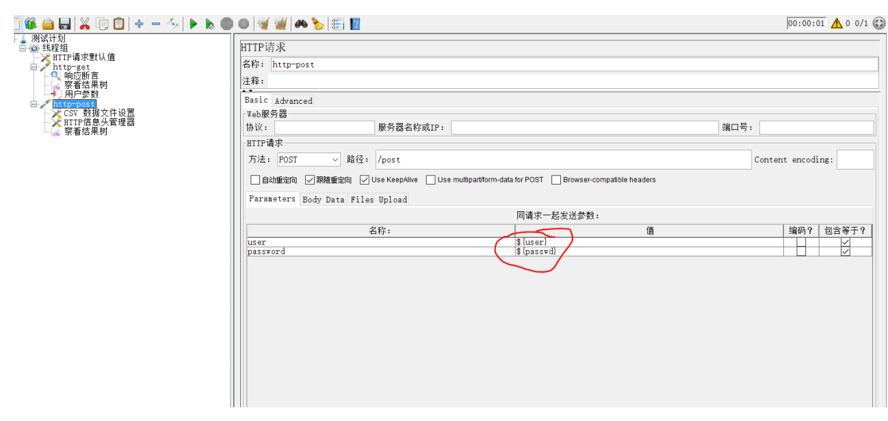

运行之后在查看结果树中请求选项栏可以看到获取的变量数据。

```
POST http://httpbin.org/post
POST data:
user=51zxw&password=8888
[no cookies]
Request Headers:
Connection: keep-alive
Content-Type : application/json
Content-Type: application/x-www-form-urlencoded
Content-Length: 24
Host: httpbin.org
User-Agent: Apache-HttpClient/4.5.5 (Java/1.8.0_05)
```


### CSV 参数化

针对之前的 POST 接口进行如下参数遍历测试：
接口如下：

	http://httpbin.org/post
发送参数：user_data.csv

	51zxw,8888
	51zxw1,6666
	51zxw2,4444
	51zxw3,5555

在之前的 csv 数据文件设置需要需改配置如下：表示把所有数据读取一遍，且不重复。


接口请求名称格式更改为：http-post-${user} 方便我们后续查看数据遍历情况。

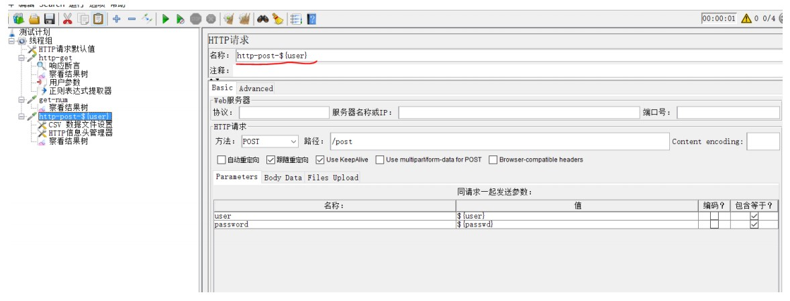

最后修改线程组的线程数量，因为数据中有 4 组数据，所以设置为 4.

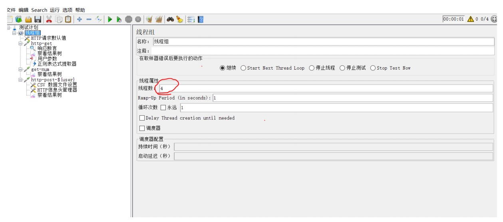

运行查看结果如下:


---

## 正则匹配

### 问题思考
接口测试过程中经常需要接口之间关联调用，比如获取上一个接口的返回值，作为另一个接口的请求参数，那么该
如何从处理呢？这里需要使用 Jmeter 的正则表达式提取器，通过对响应的数据来提取指定的数据。

### 操作案例
从请求 http-get 响应数据中匹配随机数 num 的值，然后创建请求 get-num 来引用 num 的作为请求参数。
### 设置步骤：
选中请求——添加——后置处理器——正则表达式提取器

根据 http-get 的响应，提取返回值中的 num 配置如下：

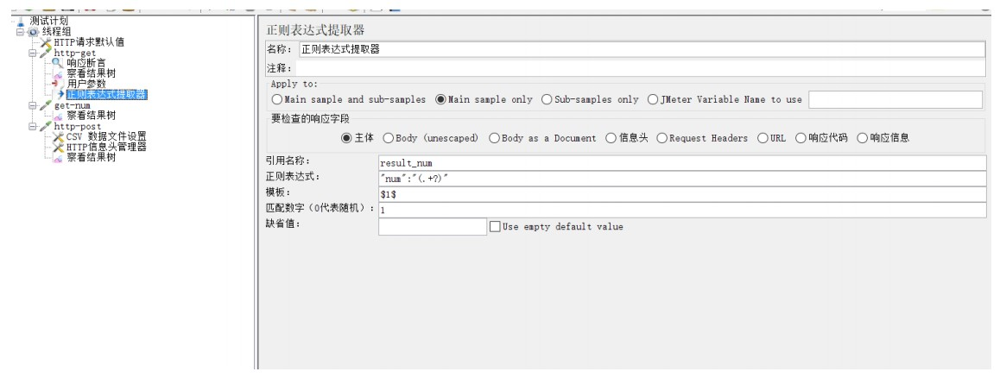


### 正则表达式配置表

* 引用名称：请求要引用的变量名称，如填写 result_num，则可用${result_num}引用它。
* 正则表达式：匹配需要的内容。
* 模板：用$num$引用起来，如果在正则表达式中有多个匹配数据，num 表示匹配到的第几个值给变量。如：
  $1$表示匹配到的第 1 个值存储在变量中。
* 匹配数字：0 代表随机取值，1 代表全部取值，
* 缺省值：如果参数没有取得到值，那默认给一个值让它取。案例中正则表达式说明
* ()括起来的部分就是要提取的。
* .匹配任何字符串。
* +一次或多次。
* ?在找到第一个匹配项后停止。

相关资料：[正则表达式教程](https://www.runoob.com/regexp/regexp-tutorial.html)

新建一个请求 get-num，在新的请求中将 http-get 返回的数据作为参数传递，如下图所示：


---


## 用例数据分离

之前我们的用例数据都是配置在 Jmeter Http 请求中，每次需要增加，修改用例都需要打开 jmeter 重新编辑，当
用例越来越多的时候，用例维护起来就越来越麻烦，有没有好的方法来解决这种情况呢？

其实我们可以将用例的数据存放在 csv 文件中，然后通过 csv 文件配置来读取用例中的数据，执行测试。用例数据

如下图所示：

### 用例设计
这里以 httpbin 接口为例，创建用例文件：jmeter-testcase.csv


用例名称变量含义：

* ${caseSeq}:用例编号
* ${apiType}:api 类型
* ${apiSeq} ：api 版本号
* ${apiName}：api 名称
* ${priority}:优先级
* ${url}:api 路径
* ${methods}:请求方法
* ${parameter}: 请求参数
* ${expectValue}:期望值，用于断言

### Jmeter 设置步骤：
1.新建一个线程组，命名为：数据驱动
2.创建一个 http 请求默认值，设置如下：

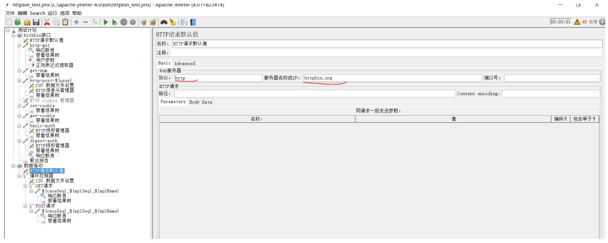


3.添加一个循环控制器 步骤为：线程组——添加——逻辑控制器——循环控制器。 循环控制器的作用可以控制整
个用例循环执行的次数。默认值是 1 根据用例数量可以修改为 4


4.在循环控制器节点下创建 CSV 文件设置，具体配置内容如下:


5.创建一个 if 控制器，步骤为：线程组——添加——逻辑控制器——if 控制器
if 控制器的作用为根据不同条件执行不同的用例，例如这里根据不同的接口请求类型，分别创建了 GET 和 POST 两个
控制器。

GET 设置的条件语句如下：


条件语句为：```"${methods}"=="GET"```其中 ${methods}表示引用 csv 中的 methods 中的值。
参数：

* Interpret Condition as Variable Expression?：如果这个选项被选中，将不会使用 js 解析;条件表达式的
  值必须是 true(忽略大小写)，这里我们取消勾选状态。

* Evaluate for all children：如果选中这一项，在每个子结点执行前都会计算表达式

POST 条件语句设置为：```"${methods}"=="POST"}```

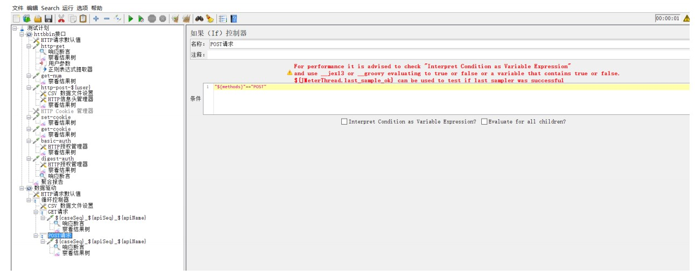

6.创建 GET 请求类型的用例如下

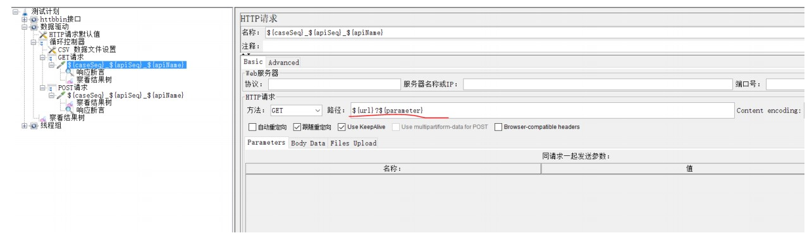

用例名称格式：```${caseSeq}_ ${apiSeq}_${apiName}```

断言设置如下：```${expectValue}```引用 csv 中对应的值。

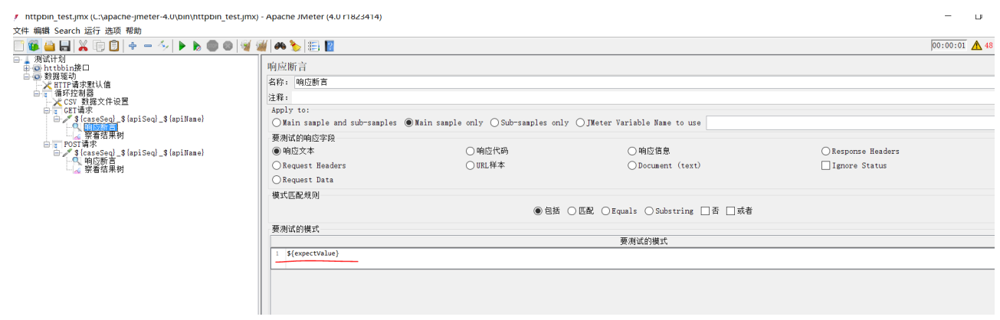

最后添加查看结果树，然后运行可以看到如下运行结果：

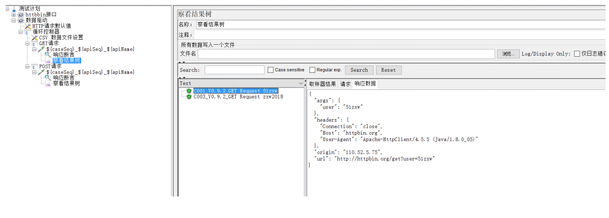


7.POST 用例设置和 GET 类似，不过参数请求不一样，是在 body 中。另外请求方式为：POST


运行结果如下:


8.最后在线程组添加一个查看结果树，执行可以查看全部用例执行情况。

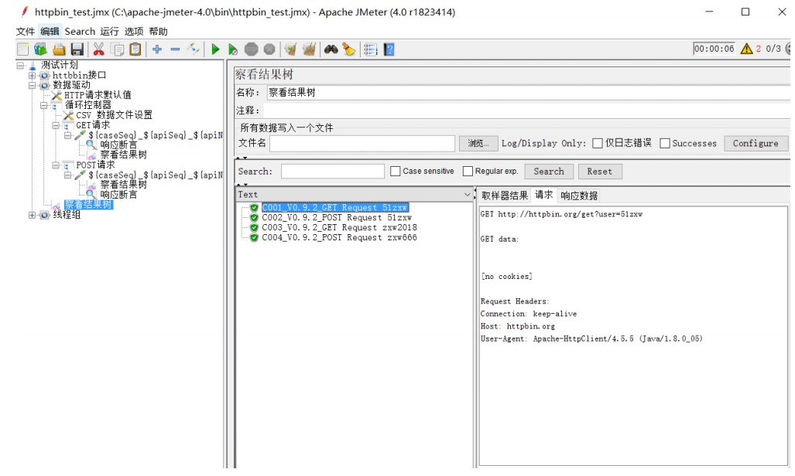


### 小结

通过这样的数据驱动，当面对大量用例时在 jmeter 设置就非常方便，后续的用例维护也非常高效，因为不用在
jmeter 一个个去单独修改用例了。

---

## Cookie 设置
### HTTP Cookie 管理器
如果你有一个 HTTP 请求，其返回结果里包含一个 cookie，那么 使用 JmeterCookie 管理器会自动将该 cookie
保存起来，而且以后所有对该网站的请求都使用同一个 cookie。每个 JMeter 线程都有自己独立的"cookie 保存
区域"。

### 案例实践
请求 URL 如下：

	http://httpbin.org/cookies/set

以上请求会返回 cookie，Cookie 内容可以通过自定义参数设置。这里我们设置 Cookie 内容如下：

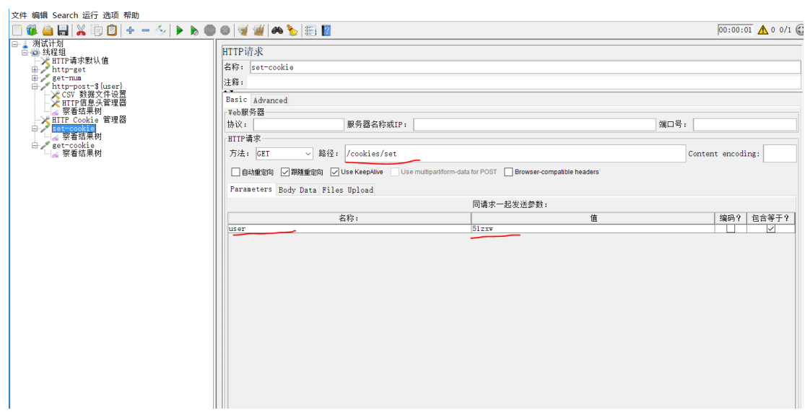

添加 Cookie 管理器：选中线程组——添加——配置元件——HTTP Cookie 管理器

运行之后我们可以在查看结果树看到 Cookie：


我们继续发送新的请求也会自动包含该 Cookie

请求 URL 为：<http://httpbin.org/cookies>


运行之后结果如下


---

## 授权设置
### 应用背景

在介绍 Postman 的过程中，我们学习了使用 Postman 对各种授权协议的接口进行测试，在 Jmeter 中同样也支持
对需要授权的接口进行测试。关于各个授权协议的内容请参考 Posman 内容中的介绍。

### Basic Auth

请求接口为：

	http://httpbin.org/basic-auth/{username}/{passwd}
设置用户名为：51zxw 密码：8888

新建 http 请求名称为：basic-auth 设置如下：

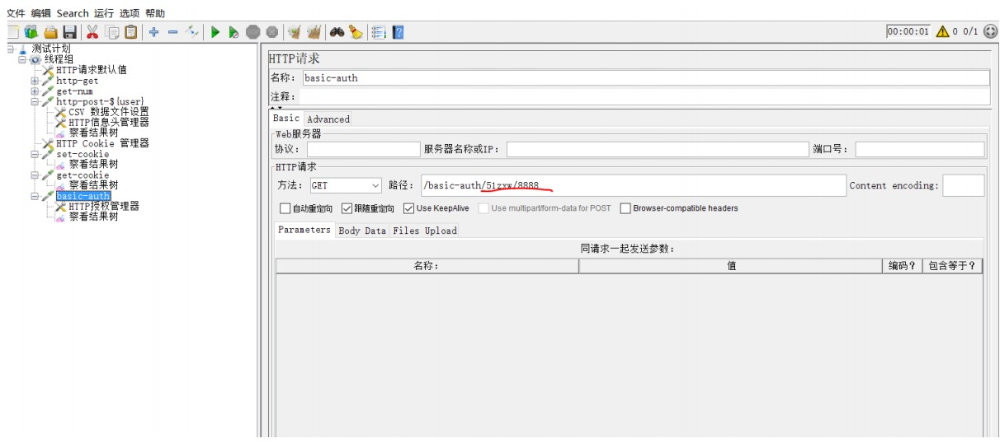

然后添加 HTTP 授权管理器：选中请求——添加——配置元件——HTTP 授权管理器 配置如下：

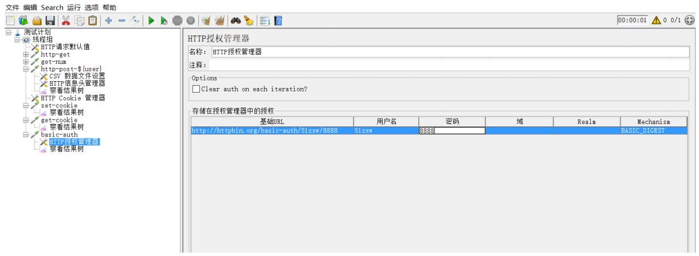

执行结果如下：

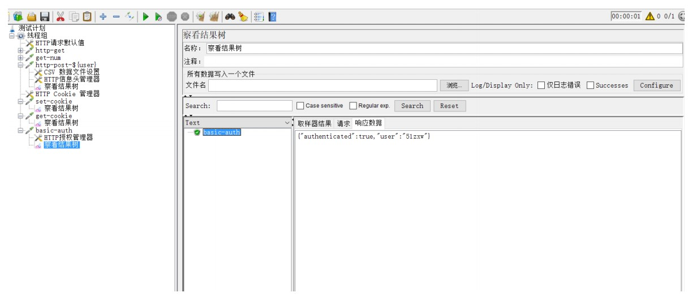

请求内容：

```
GET http://httpbin.org/basic-auth/51zxw/8888
GET data:
Cookie Data:
user=51zxw
Request Headers:
Connection: keep-alive
Host: httpbin.org
User-Agent: Apache-HttpClient/4.5.5 (Java/1.8.0_05)
Authorization: Basic NTF6eHc6ODg4OA==
```

可以请求内容中带有授权信息 **Authorization: Basic NTF6eHc6ODg4OA==** , 而 NTF6eHc6ODg4OA==这个数值就
是用 用户名：密码经过 Base64 编码后计算出来的。


### Digest Auth
请求 URL 为：

	http://httpbin.org/digest-auth/{qop}/{username}/{password}
**{qop}** 这个參数规定 server 支持哪种保护方案。client 能够从列表中(auth,auth-int)选择一个。

* auth 表示仅仅进行身份查验，
* auth-int 表示进行查验外，另一些完整性保护。

新建 http 请求：digest-auth 设置用户名为 zxw2018 密码为：8888 配置如下：


然后添加 HTTP 授权管理器 配置如下：


执行之后响应结果：

	{"authenticated":true,"user":"zxw2018"}
请求内容：

```
GET http://httpbin.org/digest-auth/auth/zxw2018/8888
GET data:
[no cookies]
Request Headers:
Connection: keep-alive
Host: httpbin.org
User-Agent: Apache-HttpClient/4.5.5 (Java/1.8.0_05)
Authorization: Digest username="zxw2018", realm="me@kennethreitz.com",
nonce="251670f7b11c5026ab699a02906fffb8", uri="/digest-auth/auth/zxw2018/8888",
response="23a0c70610b80d1f2daaf9cad6cc63f1", qop=auth, nc=00000001, cnonce="fedb59626b738c01",
algorithm=MD5, opaque="0bfc81209d832d1858f8bb4c4e4d01b6"
```

通过上面的请求内容 Authorization 值和之前的 Basic Auth 有不一样。

---

## 测试报告
批量执行完接口测试之后，我们需要查看测试报告，在之前单个接口调试我们是通过查看结果树查看结果，但是当大
批量执行接口测试之后依旧这样查看那么肯定会很低效 那么该如何设置呢？

### 聚合报告
聚合报告是一个比较精简的报告元件，可以查看每个接口的性能情况与执行结果。 设置步骤：选中线程组——添
加——监听器——聚合报告。

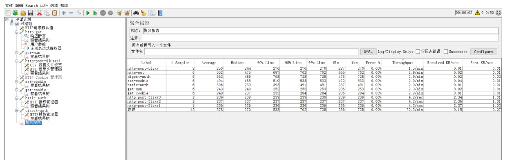

报告各个参数含义如下：
* Samples -- 本次场景中一共完成了多少个请求
* Average -- 平均响应时间(单位：ms)
* Median -- 响应时间的中值(单位：ms)
* 90% Line -- 所有请求中 90%的响应时间。
* Min -- 最小响应时间(单位：ms)
* Max -- 最大响应时间(单位：ms)
* Error -- 出错率
* Troughput -- 吞吐量
* Received--响应数据大小
* KB/sec -- 以流量做衡量的吞吐量


### HTML 报告
有时候我们需要将测试报告以 HTML 附件形式发送给各个项目成员，那么需要生成 HTML 报告。 JMeter3.0 以后
引入了 Dashboard Report，用于生成 HTML 页面格式图形化报告的扩展模块。

生成步骤：
打开 cmd 进入 jmeter 目录 bin 目录

执行命令：

	jmeter -n -t httpbin_test.jmx -l httpbin.jtl -e -o C:\Users\Shuqing\Desktop\report

命令的参数：

* -n ：以非 GUI 形式运行 Jmeter
* -t ：jmeter 脚本路径
* -l ：result.jtl 运行结果保存路径（.jtl）此文件必须不存在。
* -e ：在脚本运行结束后生成 html 报告
* -o ：用于存放 html 报告的目录，不加该参数默认生成到 bin\report-output

生成的测试报告样式如下：

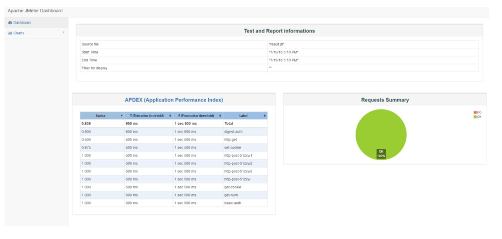


---


## 参考资料

* <https://baike.baidu.com/item/Jmeter/3104456?fr=aladdin>
* <https://blog.csdn.net/zhizunyu2009/article/details/79011413>
* <https://blog.csdn.net/gld824125233/article/details/52842914>
* <https://blog.csdn.net/defonds/article/details/53517247>
* <https://stackoverflow.com/questions/12560494/jmeter-basic-authentication>
* <https://blog.csdn.net/wuyou10206/article/details/77539791>
* <https://blog.csdn.net/huangjuyan/article/details/52993758>
* <https://www.houxue.com/news-1279775/>
* <https://blog.csdn.net/qq_35451939/article/details/79716010>